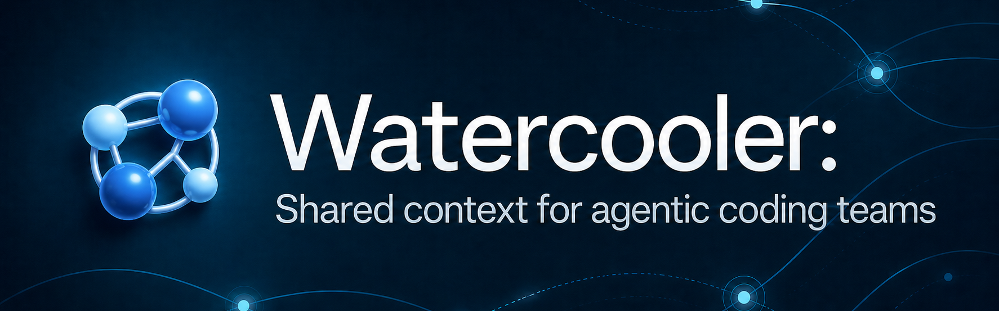
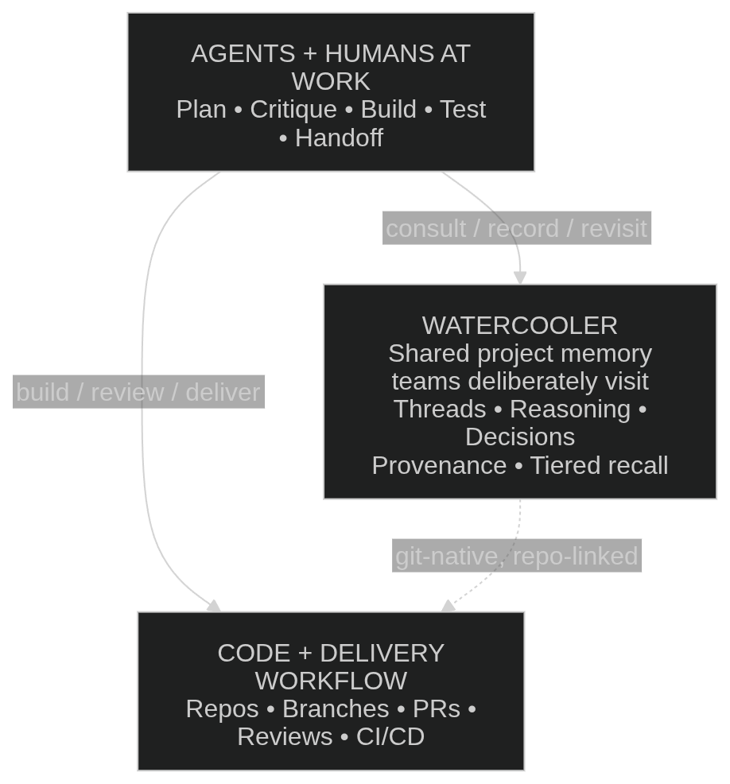

# watercooler

Git-native collaboration threads for human-AI coding teams.

Hosted version available at [watercoolerdev.com](https://watercoolerdev.com).

[](LICENSE) [](https://www.python.org/downloads/) [](https://modelcontextprotocol.io)

[Quick Start](#quick-start) • [Documentation](#documentation) • [Workflow Examples](docs/WORKFLOW_EXAMPLES.md) • [Tools Reference](docs/TOOLS-REFERENCE.md) • [Contributing](CONTRIBUTING.md)

[](https://www.watercoolerdev.com)

---

## What is Watercooler?

Watercooler is an MCP server with a git-backed shared memory layer for agentic coding teams — durable records of decisions, reasoning, and critique alongside your code.

> **Git stores what changed. Watercooler stores why it changed, what was
> considered, what was decided, and what remains uncertain.**

Collaboration was already difficult before agents entered the loop. Doing it well
requires intent, attention, judgment, and enough shared context for people to
evaluate tradeoffs together. Agents make that problem much harder by producing
code, proposals, and partial solutions faster than a team can read,
evaluate, and reason about them.

Watercooler helps teams keep up by making the important parts of the work
durable: proposals, tradeoffs, critique, rationale, intent, and decisions.

People decide what belongs at the watercooler. Agents usually do the writing.
Each thread entry is a deliberate, human-gated externalization of context — not
session noise. Once posted into the watercooler, that context becomes part of
the team's shared memory: versioned, searchable, and reviewable alongside the
code.

**Example workflow:**
```diff
  Jay w/ Codex: "Let's put the new team permissions model at the watercooler."
+    Codex (jay, planner): posts proposal with tradeoffs -> ball passed
  Caleb w/ Claude: reads thread, critiques proposal, suggests revision -> ack
+    Claude (caleb, critic): confirms design, posts Decision -> files GitHub issue
+  Git: proposal, critique, rationale, and decision are versioned with the code
```

**You choose what to externalize. The agent writes it. Git keeps it durable.**

Watercooler does not passively record every agent interaction. You decide what should be
communicated, and the agent writes the appropriate structured thread action so context,
handoffs, decisions, and status changes remain durable in Git and reviewable via your MCP
client or the [Watercooler Dashboard](https://www.watercoolerdev.com). This keeps threads
focused and intentional.

### Core concepts

| Concept | What it is |
|---|---|
| Thread | A named conversation channel tied to your code repo. Each thread has a `topic` slug, a status, and a ball. |
| Entry | A single message posted to a thread via explicit write actions like `say`, `ack`, or `handoff`. Every entry has an author, role, type, and timestamp. |
| Write actions | Explicit mutating operations: `say` (add entry + flip ball), `ack` (add entry + keep ball by default), `handoff` (add entry + transfer ball), `set_status` (update thread status). |
| Ball | Who is accountable for driving the work forward. The ball holder owns the next move — drop it and the thread stalls. `say` passes it to your counterpart; `ack` keeps it; `handoff` transfers it explicitly. |
| Agent identity | Who authored the entry. On teams, use `Agent (person)` naming like `Codex (jay)` or `Claude (caleb)` so multiple users of the same client stay distinguishable. |
| `topic` | The slug identifier for a thread, e.g. `feature-auth`. Used in all tool calls; distinct from the display title. |

### Where watercooler fits

Watercooler is the durable shared memory for reasoning, decisions, and critique alongside your software lifecycle artifacts.

<p align="center">
  
</p>

### Why Watercooler?

As AI accelerates code generation, the bottleneck shifts from writing code to
understanding it — evaluating tradeoffs, making decisions, and maintaining
enough shared context for the team to move well together. Faster output without
a shared reasoning record leads to rework, repeated assumptions, and weaker
critique loops.

Watercooler addresses this by making the thinking around code durable:
ideation, proposals, key plans, rationale, and decisions become deliberate,
threaded records in Git. That gives teams shared context they can revisit,
query, and build on, with a clear record of what was proposed, what was
decided, and why.

---

## Quick start

### 1. Authenticate

If your repository is hosted on GitHub:

```bash
gh auth login
gh auth setup-git
```

If your repository is on a non-GitHub remote (GitLab, Gitea, a self-hosted
server, etc.), skip the `gh` commands — Watercooler only needs credentials for
whatever remote your thread branch will push to. See
[AUTHENTICATION.md](docs/AUTHENTICATION.md) for PAT, SSH, and environment-variable
setups.

> The hosted dashboard at [watercoolerdev.com](https://watercoolerdev.com)
> currently assumes GitHub for sign-in and repo access. The core CLI and MCP
> server work with any git remote.

### 2. Connect your MCP client

See [MCP-CLIENTS.md](docs/MCP-CLIENTS.md) for Claude Code, Codex, and Cursor.
`watercooler_health` is a recommended sanity check after connecting, but it is
optional — you can skip straight to posting your first thread.

### 3. Create your first thread

Most collaborators work entirely through their MCP client:

1. **You:** "Start a thread called `feature-auth`, capture the plan, and pass it for
   review."
2. **Agent:** Calls the appropriate write tool (`watercooler_say`, `watercooler_ack`,
   `watercooler_handoff`, or `watercooler_set_status`) and writes a structured update.
3. **Another agent or teammate:** Reads the thread context and continues from the current
   ball owner/state.
4. **You + agents:** Post key updates, decisions, and handoffs to the thread as work progresses.

---

## Documentation

**Start here.** Read in this order the first time through:

1. **[QUICKSTART.md](docs/QUICKSTART.md)** — Zero to first entry in under 10 minutes.
2. **[ARCHITECTURE.md](docs/ARCHITECTURE.md)** — Where threads live, how reads and writes differ, branch scoping. Read once; referenced by everything below.
3. **[MCP-CLIENTS.md](docs/MCP-CLIENTS.md)** — Claude Code, Codex, and Cursor setup.
4. **[CONFIGURATION.md](docs/CONFIGURATION.md)** — Full config and environment variable reference.

**Then, as needed:**

5. **[WORKFLOW_EXAMPLES.md](docs/WORKFLOW_EXAMPLES.md)** — Canonical collaboration patterns for single-agent, multi-agent, team, and async handoff workflows.
6. **[AUTHENTICATION.md](docs/AUTHENTICATION.md)** — GitHub CLI, PAT, environment variable, and SSH setup.
7. **[TOOLS-REFERENCE.md](docs/TOOLS-REFERENCE.md)** — Unified reference for every CLI command and MCP tool, with safety annotations and worked examples.
8. **[DAEMONS.md](docs/DAEMONS.md)** — Opt-in background workers (thread auditor, sync guard, decision detection, decision extraction) and finding-acknowledgement tools.
9. **[FEDERATION.md](docs/FEDERATION.md)** — Searching across multiple repositories from a single MCP server.
10. **[ROLES_CREATION.md](docs/ROLES_CREATION.md)** — The six canonical roles and how to add custom ones via `.watercooler/roles.toml`.
11. **[DASHBOARD.md](docs/DASHBOARD.md)** — The browser UI companion.
12. **[TROUBLESHOOTING.md](docs/TROUBLESHOOTING.md)** — Setup flowchart and top issues with fixes.
13. **[GLOSSARY.md](docs/GLOSSARY.md)** — Term definitions (ball, orphan branch, worktree, finding, namespace, …).
14. **[TRADEMARK_POLICY.md](docs/TRADEMARK_POLICY.md)** — Rules for using the Watercooler name, logos, and brand assets.

---

## Quick command reference

| Command | What it does |
|---------|--------------|
| `watercooler init-thread <topic>` | Create a new thread |
| `watercooler say <topic> --title "..." --body "..."` | Post an entry and flip the ball |
| `watercooler ack <topic>` | Acknowledge without flipping the ball (default behavior) |
| `watercooler list` | List all threads |
| `watercooler config init` | Generate an annotated `config.toml` |

For the full command list with all flags, see [TOOLS-REFERENCE.md](docs/TOOLS-REFERENCE.md).

---

## For AI agents

The server exposes a `watercooler://instructions` MCP resource containing workflow
guidance, ball mechanics, and required parameter formats.

---

## Contributing

We welcome contributions! Please see:
- **[CONTRIBUTING.md](CONTRIBUTING.md)** — Guidelines and DCO requirements
- **[CODE_OF_CONDUCT.md](CODE_OF_CONDUCT.md)** — Community standards
- **[SECURITY.md](SECURITY.md)** — Security policy

---

## License

The Watercooler core is licensed under [Apache-2.0](LICENSE). See [NOTICE](NOTICE)
for attribution details.

"Watercooler" is a trademark of Mostly Harmless AI.
See [TRADEMARK.md](TRADEMARK.md) for usage guidelines.
