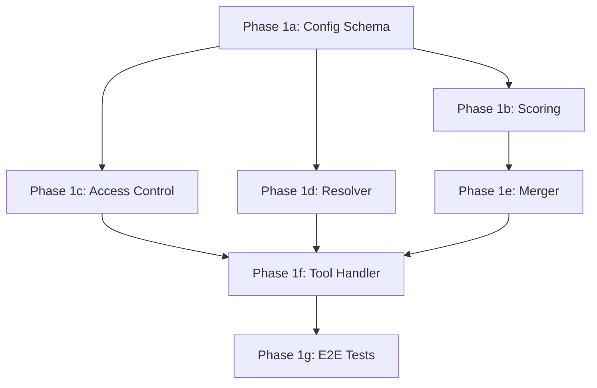

# feat: Add federated cross-namespace search (Phase 1)

## Enhancement Summary

**Deepened on:** 2026-02-20
**Review agents used:** architecture-strategist, kieran-python-reviewer, performance-oracle,
security-sentinel, agent-native-reviewer

### Key Improvements

1. **Add `max_namespaces` and `max_total_timeout`** to `FederationConfig` (required by architecture doc but omitted from original plan)
2. **Correct normalization anchor** from 2.2 to 2.4 (true theoretical max) with named constants
3. **Add security hardening**: symlink rejection in resolver, `code_path` validation, basename collision detection, case-insensitive `deny_topics`, config isolation enforcement
4. **Add agent-native support**: actionable `code_path` in "not_initialized" responses, `total_candidates_before_truncation` in envelope
5. **Reuse `_worktree_path_for`/`WORKTREE_BASE`** from `config.py` instead of reimplementing (DRY)
6. **Type safety fixes**: `ScoredResult` frozen, `entry_data: dict[str, Any]`, `Literal` status, `build_response_envelope` return type

### Estimated Latency (Performance Oracle)

| Component | Est. Latency |
|-----------|-------------:|
| Config load (cached singleton) | <1ms |
| Namespace resolution (2x `Path.exists()`) | <1ms |
| Access control (dict lookup) | <1ms |
| `search_graph()` per namespace (~20 threads, ~200 entries) | 20-50ms |
| Scoring (20 results, 4 ops each) | <1ms |
| Merger (sort, dedup, truncate) | <1ms |
| **Total (2 namespaces, parallel)** | **~30-60ms** |

The 800ms target is realistic and conservative. Scaling ceiling: ~200 threads / ~2000 entries
per namespace before the 0.4s per-namespace timeout becomes binding.

---

## Overview

Add a single new MCP tool (`watercooler_federated_search`) that performs passive, read-only
cross-namespace keyword search across configured watercooler repositories. Results are
normalized via fixed-anchor scoring, weighted by namespace proximity, and returned with
full provenance metadata in a structured response envelope.

This is the smallest useful slice of the [Federated Watercooler Architecture](../watercooler-planning/FEDERATED_WATERCOOLER_ARCHITECTURE.md)
(v4.5a). It validates scoring, access control, and namespace resolution before Phase 2
adds reference semantics or Phase 3 adds decision projections.

## Problem Statement

The intra-repo memory stack is stable (T1 baseline, T2 Graphiti, T3 LeanRAG). Cross-repo
references already exist informally in threads — agents mention decisions, patterns, or
context from sibling repositories without a formal lookup mechanism. This creates two
problems:

1. **Context fragmentation**: An agent working in `watercooler-cloud` cannot discover
   relevant decisions recorded in `watercooler-site` threads without manual intervention.
2. **Informal references rot**: When agents cite "the auth decision from the site repo,"
   there is no machine-readable link — the reference decays as threads evolve.

Federation Phase 1 addresses problem (1) by enabling cross-namespace keyword search.
Problem (2) is deferred to Phase 2 (soft-ref parsing).

## Proposed Solution

A single MCP tool (`watercooler_federated_search`) that:

1. Resolves configured namespaces via read-only filesystem worktree discovery
2. Fans out keyword searches to each namespace in parallel via `asyncio.gather()`
3. Normalizes and ranks results using multiplicative scoring:
   `RankingScore = normalize(BaseScore) x NamespaceWeight x RecencyDecay`
4. Merges results into a response envelope with per-namespace provenance and status
5. Enforces access control via per-primary allowlists and per-namespace deny_topics

The tool is feature-gated (`federation.enabled = true` in TOML config), always registered
but returns a structured error when disabled.

## Technical Approach

### Architecture

```
watercooler_federated_search (MCP tool)
  |
  v
tools/federation.py          -- Tool registration, async handler, context validation
  |
  v
federation/                  -- Core federation logic (new package)
  |-- resolver.py            -- Worktree discovery (pure filesystem, no git)
  |-- access.py              -- Allowlist + deny_topics enforcement
  |-- scoring.py             -- Fixed-anchor norm, NW tiers, RecencyDecay
  |-- merger.py              -- Response envelope build, dedup, allocation cap
  |
  v
baseline_graph/search.py     -- Existing search_graph() (unchanged)
```

**Data flow:**

```
query + code_path + config
  |
  v
[1] Resolve primary namespace (existing _require_context)
  |
  v
[2] Discover secondary namespaces (resolver.py: filesystem check)
  |
  v
[3] Enforce access control (access.py: allowlist + deny_topics)
  |
  v
[4] Fan out searches (asyncio.gather + wait_for + to_thread per namespace)
  |
  v
[5] Score and normalize each result (scoring.py)
  |
  v
[6] Merge, dedup, sort, truncate (merger.py)
  |
  v
[7] Build response envelope with provenance metadata
```

### Implementation Phases

#### Phase 1a: Config Schema + Feature Gate

Add frozen Pydantic config models to `config_schema.py` and wire into `WatercoolerConfig`.

**Files modified:**
- `src/watercooler/config_schema.py` — add `FederationScoringConfig`, `FederationNamespaceConfig`,
  `FederationAccessConfig`, `FederationConfig` models + `federation` field on `WatercoolerConfig`

**Config models (frozen for safe singleton sharing):**

```python
# src/watercooler/config_schema.py (additions)
from pydantic import ConfigDict

class FederationScoringConfig(BaseModel):
    """Scoring parameters for federated search.

    NOTE: namespace_timeout moved to FederationConfig (it's execution config,
    not scoring math). referenced_weight is Phase 2 — dormant, no Phase 1 code reads it.

    Style note: Uses ConfigDict(frozen=True) — new Pydantic v2 pattern.
    Existing config models use legacy `class Config:` pattern. This is an
    intentional upgrade for new models; see PR for rationale.
    """
    model_config = ConfigDict(frozen=True)

    local_weight: float = Field(default=1.0, description="NW for primary namespace")
    lens_weight: float = Field(default=0.7, description="NW for lens-aligned namespaces")
    wide_weight: float = Field(default=0.55, description="NW for wide-scope namespaces")
    referenced_weight: float = Field(
        default=0.85,
        description="NW for explicitly referenced namespaces (Phase 2, dormant — no Phase 1 code reads this)",
    )
    recency_floor: float = Field(default=0.7, ge=0.0, le=1.0)
    recency_half_life_days: float = Field(default=60.0, gt=0.0)


class FederationNamespaceConfig(BaseModel):
    """Configuration for a single federated namespace."""
    model_config = ConfigDict(frozen=True)

    code_path: str = Field(description="Absolute path to the namespace's code repo root")
    deny_topics: List[str] = Field(default_factory=list)

    @field_validator("code_path")
    @classmethod
    def validate_code_path(cls, v: str) -> str:
        """Reject null bytes, require absolute path, resolve traversals."""
        if "\x00" in v:
            raise ValueError("code_path contains null bytes")
        if not os.path.isabs(v):
            raise ValueError(f"code_path must be absolute, got: {v}")
        return str(Path(v).resolve())


class FederationAccessConfig(BaseModel):
    """Per-primary-namespace access allowlists."""
    model_config = ConfigDict(frozen=True)

    allowlists: Dict[str, List[str]] = Field(
        default_factory=dict,
        description="Map of primary namespace -> list of allowed secondary namespaces",
    )


class FederationConfig(BaseModel):
    """Top-level federation configuration.

    Lives at `[federation]` in TOML config, peer of [memory], [common], etc.
    """
    model_config = ConfigDict(frozen=True)

    enabled: bool = Field(default=False, description="Enable federation features")
    namespaces: Dict[str, FederationNamespaceConfig] = Field(default_factory=dict)
    access: FederationAccessConfig = Field(default_factory=FederationAccessConfig)
    scoring: FederationScoringConfig = Field(default_factory=FederationScoringConfig)
    namespace_timeout: float = Field(
        default=0.4, gt=0.0,
        description="Per-namespace search timeout in seconds",
    )
    max_namespaces: int = Field(
        default=5, ge=1, le=20,
        description="Hard cap on namespaces per query; exceeding is rejected (architecture doc §14.1)",
    )
    max_total_timeout: float = Field(
        default=2.0, gt=0.0,
        description="Total wall-clock budget for all namespace searches combined",
    )

    @model_validator(mode="after")
    def check_no_basename_collisions(self) -> "FederationConfig":
        """Reject configs where two namespaces map to the same worktree basename."""
        basenames: Dict[str, str] = {}
        for ns_id, ns_config in self.namespaces.items():
            basename = Path(ns_config.code_path).name
            if basename in basenames:
                raise ValueError(
                    f"Namespace basename collision: '{ns_id}' and '{basenames[basename]}' "
                    f"both resolve to worktree basename '{basename}'"
                )
            basenames[basename] = ns_id
        return self
```

**TOML example (to add to `config.example.toml` and `~/.watercooler/config.toml`):**

```toml
# =============================================================================
# FEDERATION SETTINGS
# Cross-namespace search across configured watercooler repositories
# =============================================================================
[federation]

# Enable federation features
# Env: WATERCOOLER_FEDERATION_ENABLED
# enabled = false

# [federation.namespaces.site]
# code_path = "/home/user/projects/watercooler-site"
# deny_topics = ["internal-hiring"]

# [federation.access]
# Per-primary allowlists: which secondaries can this primary query?
# Default: closed (no entry = no remote access)
# allowlists = { "cloud" = ["site"] }

# [federation.scoring]
# recency_half_life_days = 60
# recency_floor = 0.7
#
# # Execution config (on FederationConfig, not ScoringConfig):
# # namespace_timeout = 0.4
# # max_namespaces = 5
# # max_total_timeout = 2.0
```

**WatercoolerConfig addition** (`config_schema.py:960`):

```python
class WatercoolerConfig(BaseModel):
    ...
    memory: MemoryConfig = Field(default_factory=MemoryConfig)
    federation: FederationConfig = Field(default_factory=FederationConfig)  # NEW
```

**Tasks:**
- [x] Add `ConfigDict`, `field_validator`, `model_validator` imports from pydantic (`config_schema.py`)
- [x] Add `os` and `Path` imports if not present (`config_schema.py`)
- [x] Add 4 frozen Pydantic models before `WatercoolerConfig` (`config_schema.py`)
- [x] Add `federation` field on `WatercoolerConfig` (`config_schema.py:960`)
- [x] Add `code_path` field_validator (absolute path, no null bytes, resolve traversals)
- [x] Add `check_no_basename_collisions` model_validator on `FederationConfig`
- [x] Add TOML example section to `config.example.toml` (`src/watercooler/templates/config.example.toml`)
- [x] Write unit tests for config validation (`tests/unit/test_federation_config.py`)

**Success criteria:**
- `WatercoolerConfig()` creates default federation config with `enabled=False`
- Frozen models reject mutation (`config.federation.enabled = True` raises error)
- TOML `[federation]` section round-trips through `config_loader.get_config()`
- Relative `code_path` raises `ValidationError`
- `code_path` with null bytes raises `ValidationError`
- Two namespaces with same basename raises `ValidationError`
- `max_namespaces` default is 5; value > 20 raises `ValidationError`

### Phase 1a Research Insights

**Style boundary (Python reviewer):** Config schema additions MUST use `typing.List`/`typing.Dict`
to match the existing 960+ lines in `config_schema.py`. New `federation/` package files use modern
`list[str]`, `dict[str, ...]`, `str | None` syntax (with `from __future__ import annotations`).
Do not mix conventions within a single file.

**`ConfigDict` vs `class Config` (Python reviewer):** Existing models like `SyncConfig` use the
legacy Pydantic v1 `class Config:` pattern. New federation models use `model_config = ConfigDict(frozen=True)`.
Add a code comment acknowledging this is an intentional upgrade, not an oversight.

**`namespace_timeout` location (Python reviewer, performance oracle):** Moved from `ScoringConfig`
to `FederationConfig` — a network timeout is execution config, not ranking math. The scoring module
accepts it as a parameter from the caller.

**`max_namespaces` (security sentinel):** Required by architecture doc §14.1 but was missing from
the original plan. Without it, a misconfigured TOML could create 50+ concurrent thread pool workers.

**Basename collision detection (security sentinel, architecture strategist):** The `_worktree_path_for()`
function uses `code_root.name`. Two namespaces at `/work/myapp` and `/personal/myapp` would collide.
The `model_validator` catches this at config load time.

**`referenced_weight` is dead code (Python reviewer):** Phase 1 code never reads it. The description
now explicitly says "Phase 2, dormant — no Phase 1 code reads this." This is acceptable: removing
and re-adding in Phase 2 would churn the TOML schema.

---

#### Phase 1b: Federation Package — Scoring Module

Implement the scoring math in isolation, fully testable without filesystem or async.

**New file:** `src/watercooler_mcp/federation/scoring.py`

**Functions:**

```python
"""Fixed-anchor normalization, NW tier resolution, RecencyDecay.

Style: modern Python 3.10+ syntax (list[str], str | None) throughout.
Config schema additions use typing.List/Dict for consistency with config_schema.py.
"""

# Named constants — source: baseline_graph/search.py:620-629
# Max = 1.0 (base) + 0.5 (title) + 0.3 (body) + 6*0.1 (6 matched_fields) = 2.4
KEYWORD_SCORE_MIN = 1.0
KEYWORD_SCORE_MAX = 2.4
_SCORE_RANGE = KEYWORD_SCORE_MAX - KEYWORD_SCORE_MIN  # 1.4

_LN2 = math.log(2)  # ~0.6931 — used in RecencyDecay

def normalize_keyword_score(raw_score: float) -> float:
    """Fixed-anchor normalization for keyword search scores.

    Formula: clamp((score - KEYWORD_SCORE_MIN) / _SCORE_RANGE, 0.0, 1.0)
    Calibrated to actual keyword range [1.0, 2.4] from
    baseline_graph/search.py:620-629.

    NOTE: If searchable fields change in search.py, update KEYWORD_SCORE_MAX.
    """

def resolve_namespace_weight(
    namespace: str,
    primary_namespace: str,
    lens_namespaces: frozenset[str],
    scoring_config: FederationScoringConfig,
) -> float:
    """Resolve NW tier for a namespace.

    Returns:
        local_weight (1.0) if namespace == primary
        lens_weight (0.7) if namespace in lens_namespaces
        wide_weight (0.55) otherwise
    """

def compute_recency_decay(
    entry_timestamp: datetime,
    now: datetime,
    floor: float = 0.7,
    half_life_days: float = 60.0,
) -> float:
    """Exponential recency decay with configurable floor.

    Formula: floor + (1 - floor) * exp(-_LN2 * age_days / half_life)
    Anchor: datetime.now(UTC) at query execution time.
    Compute `now` ONCE per query, pass to all calls.
    """

def compute_ranking_score(
    raw_score: float,
    namespace_weight: float,
    recency_decay: float,
) -> float:
    """Multiplicative composition: normalize(raw_score) * NW * RecencyDecay."""
```

**Tasks:**
- [x] Create `src/watercooler_mcp/federation/__init__.py` (package init, docstring only)
- [x] Implement `scoring.py` with 4 functions (`src/watercooler_mcp/federation/scoring.py`)
- [x] Write unit tests (`tests/unit/test_federation_scoring.py`)

**Test cases:**
- `normalize_keyword_score(1.0)` = `0.0` (KEYWORD_SCORE_MIN)
- `normalize_keyword_score(2.4)` = `1.0` (KEYWORD_SCORE_MAX — corrected from 2.2)
- `normalize_keyword_score(1.7)` = `0.5`
- `normalize_keyword_score(0.5)` clamps to `0.0`
- `normalize_keyword_score(3.0)` clamps to `1.0`
- `compute_recency_decay(now, now)` = `1.0`
- `compute_recency_decay(60d_ago, now)` = `~0.85`
- `compute_recency_decay(365d_ago, now)` = `~0.7` (floor)
- Removing namespace C does not reorder A/B results (multiplicative independence)

### Phase 1b Research Insights

**Normalization anchor correction (architecture strategist):** The true theoretical max keyword
score is `1.0 + 0.5 + 0.3 + 6*0.1 = 2.4` (6 possible matched fields: title, body, summary,
agent, role, entry_type), not 2.2 as originally stated. Use named constants `KEYWORD_SCORE_MIN`
and `KEYWORD_SCORE_MAX` with a comment referencing `search.py:620-629` so future changes to
baseline scoring trigger a review.

**Magic number removal (Python reviewer):** `0.693` in RecencyDecay is `ln(2)`. Use `math.log(2)`
or a named constant `_LN2` for readability.

**Add `__all__` to new modules (Python reviewer, architecture strategist):** Define explicit
public API surface in each new module: `scoring.py`, `access.py`, `resolver.py`, `merger.py`.
Follows the `memory_queue/__init__.py` pattern.

---

#### Phase 1c: Federation Package — Access Control

Implement allowlist + deny_topics enforcement.

**New file:** `src/watercooler_mcp/federation/access.py`

**Functions:**

```python
def filter_allowed_namespaces(
    primary_namespace: str,
    requested_namespaces: list[str],
    access_config: FederationAccessConfig,
) -> tuple[list[str], dict[str, str]]:
    """Filter requested namespaces against per-primary allowlist.

    Returns:
        (allowed_namespaces, denied_map)
        denied_map: {namespace: "access_denied"} for namespaces not in allowlist
    """

def is_topic_denied(
    topic: str,
    namespace: str,
    namespace_config: FederationNamespaceConfig,
) -> bool:
    """Check if a topic is denied for a namespace.

    Case-insensitive comparison: normalizes both topic and deny_topics
    to lowercase before matching.

    Returns True if the topic should be excluded (is in deny list).
    """
```

**Tasks:**
- [x] Implement `access.py` (`src/watercooler_mcp/federation/access.py`)
- [x] Write unit tests (`tests/unit/test_federation_access.py`)

**Test cases:**
- Primary namespace always allowed (never filtered)
- Namespaces not in allowlist denied with status `"access_denied"`
- Topics in `deny_topics` excluded from results
- `deny_topics = ["internal-hiring"]` blocks `Internal-Hiring` (case-insensitive)
- ALL secondaries denied = empty secondary results (not error)
- Empty allowlist for a primary = no secondary access (closed by default)
- Missing primary entry in allowlists = closed by default

### Phase 1c Research Insights

**Rename `filter_deny_topics` → `is_topic_denied` (Python reviewer):** A function named
`filter_deny_topics` that returns `True` when excluded is a double-negative cognitive trap.
`is_topic_denied` is self-documenting at call sites: `if is_topic_denied(topic, ns, config): continue`.

**Case-insensitive deny matching (security sentinel):** Thread topics are typically kebab-case
but there is no canonical normalization. Normalize both sides to `.lower()` before comparison
to prevent bypass via casing variations.

---

#### Phase 1d: Federation Package — Resolver

Implement read-only worktree discovery.

**New file:** `src/watercooler_mcp/federation/resolver.py`

**Data class + functions:**

```python
@dataclass(frozen=True)
class NamespaceResolution:
    namespace_id: str
    threads_dir: Path | None
    code_path: Path
    status: Literal["ok", "not_initialized", "error"]
    is_primary: bool = False
    error_message: str = ""
    action_hint: str = ""  # Agent-friendly remediation hint


def discover_namespace_worktree(
    namespace_id: str,
    namespace_config: FederationNamespaceConfig,
) -> Path | None:
    """Discover existing worktree via filesystem check.

    Imports and uses _worktree_path_for() and WORKTREE_BASE from
    watercooler_mcp.config (DRY — single worktree path convention).

    Security: rejects symlinked worktree paths and paths escaping WORKTREE_BASE.
    No git operations. Pure Path.exists() + Path.is_dir() + symlink check.
    Returns resolved worktree path if exists, None if not initialized.

    IMPORTANT: Does NOT call resolve_thread_context() — that would trigger
    git operations and env var overrides (WATERCOOLER_DIR) that break
    config isolation (architecture doc §6.6).
    """


def resolve_all_namespaces(
    primary_context: ThreadContext,
    federation_config: FederationConfig,
    namespace_override: list[str] | None = None,
) -> dict[str, NamespaceResolution]:
    """Resolve all configured (or overridden) namespaces.

    Primary: uses existing ThreadContext.threads_dir (already resolved).
    Secondaries: filesystem worktree discovery via discover_namespace_worktree().

    When status="not_initialized", includes action_hint with the code_path
    so agents can self-bootstrap by calling watercooler_health(code_path=...).

    NOTE: watercooler_list_threads would also work but triggers
    resolve_thread_context() → _create_orphan_branch() → push, where push
    failures are silently swallowed. watercooler_health is a lighter-weight
    alternative that still bootstraps the worktree without side effects.
    Verify the chosen tool actually creates the worktree before recommending.
    """
```

**Tasks:**
- [x] Import `_worktree_path_for`, `WORKTREE_BASE` from `watercooler_mcp.config`
- [x] Implement `resolver.py` (`src/watercooler_mcp/federation/resolver.py`)
- [x] Add symlink rejection + `WORKTREE_BASE` escape check in `discover_namespace_worktree()`
- [x] Include `action_hint` in `NamespaceResolution` for "not_initialized" status
- [x] Write unit tests with mocked filesystem (`tests/unit/test_federation_resolver.py`)

**Test cases:**
- Existing worktree at `~/.watercooler/worktrees/<repo_name>/` discovered
- Missing worktree returns `status="not_initialized"` with `action_hint` including `code_path`
- No git commands executed (pure filesystem check)
- Primary uses existing `ThreadContext.threads_dir`
- Namespace override replaces configured namespaces
- Override with invalid repo = secondary failure (not hard error)
- Symlinked worktree path rejected (returns None with warning log)
- Resolved path escaping `WORKTREE_BASE` rejected
- With `WATERCOOLER_DIR` env var set, secondaries still resolve to own worktrees (config isolation)

### Phase 1d Research Insights

**DRY violation fix (architecture strategist):** Import `_worktree_path_for` and `WORKTREE_BASE`
from `watercooler_mcp.config` instead of reimplementing. If the underscore prefix is uncomfortable,
promote to `worktree_path_for` (remove underscore) and import in both config.py and resolver.py.

**Symlink rejection (security sentinel, HIGH):** Between `Path.exists()` check and actual I/O in
`search_graph()`, a worktree could be replaced with a symlink to an arbitrary directory. Add
`Path.is_symlink()` check and verify `Path.resolve()` stays under `WORKTREE_BASE`.

**Config isolation enforcement (security sentinel, MEDIUM):** The resolver MUST NOT call
`resolve_thread_context()` for secondary namespaces — that would apply `WATERCOOLER_DIR` env var
override, collapsing all namespaces to the same threads directory. Add a defensive assertion
verifying each secondary's `threads_dir` differs from primary.

**Agent self-service (agent-native reviewer, CRITICAL):** When a secondary is "not_initialized",
include `action_hint: "Run watercooler_list_threads(code_path='/path/to/repo') to bootstrap"`
so agents can self-heal without human intervention. The `code_path` value is already available
from `FederationNamespaceConfig.code_path`.

**Use `Literal` type for status (Python reviewer):** `status: Literal["ok", "not_initialized", "error"]`
catches invalid values at construction time. Follows the `SearchQuery.combine: Literal["AND", "OR"]`
pattern from `search.py:70`.

---

#### Phase 1e: Federation Package — Merger

Build the response envelope, handle dedup, allocation cap, and sorting.

**New file:** `src/watercooler_mcp/federation/merger.py`

**Data class + functions:**

```python
@dataclass(frozen=True)
class ScoredResult:
    """Immutable scored result — constructed once, never mutated."""
    entry_id: str
    origin_namespace: str
    raw_score: float
    normalized_score: float
    namespace_weight: float
    recency_decay: float
    ranking_score: float
    entry_data: dict[str, Any]  # Serialized SearchResult fields
    timestamp: str              # ISO 8601, for tiebreaking


def allocate_candidates(limit: int) -> tuple[int, int]:
    """Compute candidate allocation.

    Primary: gets full `limit` candidates (uncapped).
    Secondary: each gets max(limit // 2, 1) candidates.
    Returns (primary_limit, per_secondary_limit).

    NOTE: per_secondary_limit is passed as SearchQuery.limit to secondary
    search_graph() calls to enable early termination (search.py:650).
    """


def merge_results(
    namespace_results: dict[str, list[ScoredResult]],
    primary_namespace: str,
    limit: int,
    min_score: float = 0.01,
) -> list[ScoredResult]:
    """Merge, filter, dedup, sort, truncate.

    1. Filter out results with RankingScore < min_score
    2. Dedup by entry_id (safety net)
    3. Sort by RankingScore descending
    4. Tiebreak: primary first, then newest timestamp, then entry_id
    5. Truncate to limit
    """


def build_response_envelope(
    results: list[ScoredResult],
    primary_namespace: str,
    namespace_status: dict[str, str],
    queried_namespaces: list[str],
    query: str,
    total_candidates: int,
) -> dict[str, Any]:
    """Build federation response envelope with provenance metadata.

    Includes schema_version: 1 for forward compatibility with Phase 2.
    Includes total_candidates_before_truncation so agents know if
    increasing limit would yield more results.

    # TODO(Phase 5): Collapse distinct namespace_status values into
    # "unresolvable" for non-owning namespaces in multi-tenant context.
    # Score breakdowns may also need suppression. See architecture doc §6.3.
    """
```

**Response envelope structure:**

```json
{
  "schema_version": 1,
  "primary_namespace": "cloud",
  "queried_namespaces": ["cloud", "site"],
  "namespace_status": {"cloud": "ok", "site": "ok"},
  "namespace_search_mode": {"cloud": "keyword:main", "site": "keyword:*"},
  "result_count": 5,
  "total_candidates_before_truncation": 12,
  "results": [
    {
      "entry_id": "01JKLM...",
      "origin_namespace": "cloud",
      "topic": "auth-protocol",
      "title": "Use OAuth2 with PKCE",
      "ranking_score": 0.874,
      "score_breakdown": {
        "raw_score": 1.9,
        "normalized_score": 0.643,
        "namespace_weight": 1.0,
        "recency_decay": 0.95
      },
      "entry_data": { ... }
    }
  ]
}
```

**Tasks:**
- [x] Implement `merger.py` with frozen `ScoredResult` dataclass (`src/watercooler_mcp/federation/merger.py`)
- [x] Write unit tests (`tests/unit/test_federation_merger.py`)

**Test cases:**
- `allocate_candidates(10)` returns `(10, 5)`
- `allocate_candidates(1)` returns `(1, 1)` (minimum 1)
- Results sorted by RankingScore descending
- Tiebreaker: primary first, then newest timestamp, then entry_id
- Results with `ranking_score < 0.01` filtered out
- Dedup by entry_id removes duplicates
- Partial failure: missing namespaces don't affect remaining ordering
- Empty namespace results handled gracefully
- `total_candidates_before_truncation` reflects pre-truncation count

### Phase 1e Research Insights

**`ScoredResult` must be frozen (Python reviewer, CRITICAL):** The data flow is construct-once,
consume read-only. No code path mutates a `ScoredResult` after construction. Use
`@dataclass(frozen=True)` — same as `NamespaceResolution`.

**Type `entry_data` properly (Python reviewer, CRITICAL):** Bare `dict` is an untyped escape hatch.
At minimum: `dict[str, Any]`. Consider a `TypedDict` or reusing `GraphEntry` from `search.py`
if the field set stabilizes.

**Type `build_response_envelope` return (Python reviewer):** `dict` → `dict[str, Any]`.

**Remove unused `namespace_count` from `allocate_candidates` (Python reviewer):** The implementation
does not use it — primary always gets `limit`, secondary always gets `max(limit // 2, 1)`.
If not used, don't accept it (YAGNI).

**Pass `per_secondary_limit` to secondary searches (performance oracle):** The allocation function
returns `per_secondary_limit`. Pass it as `SearchQuery.limit` for secondary namespace calls so
`search_graph()` terminates early at line 650 (`matching_results[:limit]`), avoiding unnecessary
node materialization.

**`total_candidates_before_truncation` (agent-native reviewer):** Include in the envelope so
agents know whether increasing `limit` would yield more results.

**`primary_branch_filter` (agent-native reviewer):** Include in envelope metadata so agents can
see what `code_branch` filter was applied to the primary namespace.

**Consider `federation/types.py` (architecture strategist):** `NamespaceResolution` and
`ScoredResult` are cross-module types consumed by multiple files. Placing them in a shared
`types.py` follows the `memory_queue/task.py` pattern. This is optional for Phase 1 but
recommended if more types emerge.

---

#### Phase 1f: MCP Tool Handler + Registration

Wire the federation package into an MCP tool with async execution.

**New file:** `src/watercooler_mcp/tools/federation.py`

**Modified files:**
- `src/watercooler_mcp/tools/__init__.py` — add import + registration
- `src/watercooler_mcp/server.py` — add import + registration call + re-export

**Tool signature:**

```python
async def _federated_search_impl(
    ctx: Context,
    query: str,
    code_path: str = "",
    code_branch: str = "",      # Applied to PRIMARY namespace only; secondaries search all branches
    namespaces: str = "",       # Comma-separated override (follows existing pattern: bulk_index, graph_recover)
    limit: int = 10,
) -> str:
    """Search across federated watercooler namespaces.

    Args:
        query: Search query (required, max 500 chars).
        code_path: Primary repository root path.
        code_branch: Branch filter for PRIMARY namespace only.
            Secondary namespaces always search all branches.
        namespaces: Comma-separated namespace IDs to search (override).
            Leave empty to search all configured namespaces.
        limit: Max results to return (1-100, default 10).

    Returns:
        JSON response envelope with schema_version, results, and
        per-namespace provenance metadata. See Response Envelope section.
    """
```

**Implementation flow:**

```
1. Feature gate check → FEDERATION_DISABLED error if false
2. Validate inputs (query non-empty + max 500 chars, limit 1-100)
3. Check federation.enabled before _require_context (fail fast without git overhead)
4. Resolve primary context (_require_context)
5. Hosted mode guard → FEDERATION_NOT_AVAILABLE if hosted
6. Resolve namespaces (resolver.py)
7. Check max_namespaces cap → reject if exceeded (no silent truncation)
8. Access control (access.py)
9. Compute allocation (merger.py: allocate_candidates)
10. Fan out parallel searches:
    - asyncio.wait_for(asyncio.gather(...), timeout=max_total_timeout)
    - Per-namespace: asyncio.wait_for(asyncio.to_thread(search_graph, ...), timeout=namespace_timeout)
    - Skip is_graph_available() pre-check (search_graph handles empty case at line 492-494)
    - Use per_secondary_limit for secondary SearchQuery.limit
11. Check primary status (fail-hard if failed)
12. Score all results (scoring.py)
13. Merge + build envelope (merger.py)
14. Return JSON
```

**Key decisions:**
- `code_branch` applied to primary namespace only (secondaries search all branches)
- Per-namespace timeout: `federation.namespace_timeout` (default 0.4s, on FederationConfig)
- Total query budget: `federation.max_total_timeout` (default 2.0s, wraps asyncio.gather)
- Phase 1 uses baseline graph keyword search only (all namespaces)
- Tool always registered, returns structured error when disabled
- `lens` parameter deferred to Phase 2 (removed from Phase 1 signature)
- Error response format: use `WatercoolerError` exception hierarchy for gate errors
  (`FederationDisabledError`, `FederationNotAvailableError`); in-band `namespace_status`
  for partial failures

**Logging (follows existing observability.py patterns):**
- INFO: tool call summary (total duration, namespaces queried, result count)
- DEBUG: per-namespace timing, score breakdowns, access control decisions
- ERROR: namespace failures
- Sanitize query string before logging (strip control characters)

**Tasks:**
- [x] Implement `tools/federation.py` (`src/watercooler_mcp/tools/federation.py`)
- [x] Add `from .federation import register_federation_tools` to `tools/__init__.py`
- [x] Add `register_federation_tools(mcp)` to `register_all_tools()` in `tools/__init__.py`
- [x] Add import + registration call in `server.py` (after migration tools)
- [x] Add re-export for test compatibility in `server.py`
- [x] Add `watercooler_federated_search` to `_TOOL_TIMEOUTS` in `middleware.py` (5.0s — under default 50s)
- [x] Add query length validation (max 500 chars)
- [x] Add `max_namespaces` enforcement (reject, not truncate, per architecture doc §14.1)
- [x] Add outer `asyncio.wait_for()` with `max_total_timeout` around `asyncio.gather()`
- [x] Write integration test (`tests/integration/test_federation_tool.py`)

**Integration test scenarios:**
- Full happy path with mocked `search_graph()`
- Feature disabled → structured error (FEDERATION_DISABLED code)
- Primary failure → hard error
- Secondary timeout → partial results
- Hosted mode → FEDERATION_NOT_AVAILABLE
- Empty query → EMPTY_QUERY error
- Query > 500 chars → VALIDATION_ERROR
- Namespace count exceeds `max_namespaces` → rejection
- Access control denied → partial results with denied status
- Total timeout exceeded → partial results

### Phase 1f Research Insights

**Remove `lens` parameter from Phase 1 (agent-native reviewer, Python reviewer):** The `lens`
parameter has no config model, no TOML section, no resolution logic, and no discovery mechanism.
Shipping an undiscoverable parameter that silently does nothing is worse than omitting it.
Add it in Phase 2 when the lens-to-namespace mapping is defined.

**`max_namespaces` enforcement (security sentinel):** Architecture doc §14.1 requires this.
Without it, a misconfigured TOML could create 50+ concurrent thread pool workers. Reject
requests exceeding the cap with an explicit error — no silent truncation.

**Outer `asyncio.wait_for` (performance oracle, security sentinel):** Wrap the entire
`asyncio.gather()` with `asyncio.wait_for(gather, timeout=max_total_timeout)` to prevent
worst-case where all N namespaces approach their individual timeouts simultaneously.

**Add to `_TOOL_TIMEOUTS` (performance oracle):** The default 50s middleware timeout is too
generous for a search operation. Add `"watercooler_federated_search": 5.0` to catch
performance regressions.

**Skip double `is_per_thread_format()` check (performance oracle):** In the federation fan-out,
call `search_graph()` directly without the `is_graph_available()` pre-check. `search_graph()`
already handles the empty case at line 492-494. Saves 2*N redundant filesystem validations.

**Use `WatercoolerError` hierarchy (agent-native reviewer):** Adopt the existing exception
pattern from `errors.py` for feature-gate errors. Add `FederationDisabledError` with
`code = "FEDERATION_DISABLED"` and `FederationNotAvailableError` with
`code = "FEDERATION_NOT_AVAILABLE"`. This gives agents structured JSON-RPC errors with stable
codes instead of string matching.

**Validate `federation.enabled` before `_require_context` (architecture strategist):** Check
the feature gate before calling `_require_context()` to fail fast without any git subprocess
overhead. Config is cached via singleton, so this is a <1ms check.

**Also wrap existing `_search_baseline_impl` in `asyncio.to_thread()` (performance oracle):**
The existing single-namespace `watercooler_search` blocks the event loop during its full scan.
If federation adds `to_thread` wrappers, the existing path should get the same treatment for
consistency and correctness (aligns with PR #172 pattern).

**Document `code_branch` asymmetry (agent-native reviewer):** Add explicit docstring note that
`code_branch` applies to primary only. Include `primary_branch_filter` in the response envelope
so agents can see what filter was applied.

**Document scaling ceiling (performance oracle):** Phase 1 keyword search is O(T+E) per namespace.
Designed for current volumes (tens of threads, hundreds of entries). Index-based search is a
Phase 2 requirement if volumes grow past ~200 threads/namespace.

---

#### Phase 1g: E2E Test with JSONL Fixtures

Create realistic test fixtures and validate the full pipeline end-to-end.

**NOTE (architecture strategist):** Place E2E tests in `tests/integration/` with a
`@pytest.mark.e2e` marker, not a new `tests/e2e/` directory. No `tests/e2e/` directory
currently exists and all integration-style tests live in `tests/integration/`.

**New files:**
- `tests/integration/test_federation_e2e.py` (with `@pytest.mark.e2e` marker)
- `tests/fixtures/federation/primary-repo/graph/baseline/threads/` (per-thread JSONL)
- `tests/fixtures/federation/secondary-repo/graph/baseline/threads/` (per-thread JSONL)

**Fixture data:**
- Primary: ~15 entries across 2 threads (e.g., "auth-protocol", "deploy-pipeline")
- Secondary: ~10 entries across 2 threads (e.g., "frontend-auth", "site-deploy")
- Overlapping topics to test cross-namespace relevance
- Entries with varying timestamps to test RecencyDecay

**Test scenarios:**
- [x] Multi-namespace search returns results from both namespaces
- [x] Namespace weights correctly differentiate primary vs secondary
- [x] RecencyDecay applies correctly to older entries
- [x] Allocation cap prevents secondary from dominating
- [x] `deny_topics` excludes matching entries
- [x] Partial failure (one namespace missing) returns healthy results
- [x] `test_partial_failure_ranking_stability()` — ranking independence proof

**Tasks:**
- [x] Create fixture JSONL data in per-thread format (programmatic via `_create_graph_fixture()`)
- [x] Implement E2E tests (`tests/integration/test_federation_e2e.py`)
- [x] Register `e2e` pytest marker in `pyproject.toml`

---

### Implementation Order and Dependencies



**Phase 1a** must come first (config models imported everywhere).
**Phases 1b, 1c, 1d** are independent — can be developed in parallel.
**Phase 1e** depends on 1b (scoring produces `ScoredResult`).
**Phase 1f** depends on all prior phases.
**Phase 1g** depends on 1f.

Estimated scope: ~600 LOC implementation + ~700 LOC tests (revised up for security
hardening, config validation, and agent-native improvements).

## Alternative Approaches Considered

1. **Sub-package under `tools/`** — Rejected. Federation logic (scoring, access, resolver,
   merger) is domain logic, not tool registration. Keeping it in `federation/` follows the
   `memory_queue/` precedent.

2. **Graphiti-backed search** — Deferred. Phase 1 uses baseline graph keyword search only.
   The normalization formula is calibrated for keyword scores [1.0, 2.2]. Heterogeneous
   backends require per-backend normalization (Phase 2).

3. **Conditional tool registration** — Rejected. Always registering with a clear error when
   disabled is more discoverable than hiding the tool.

4. **Global config cache for namespace resolution** — Rejected per architecture doc §6.6.
   Federation *config* (the `FederationConfig` model) is read from global TOML. But
   `threads_dir` and `group_id` are resolved per-namespace at query time via
   worktree discovery, not global env overrides.

## Acceptance Criteria

### Functional Requirements

- [x] `watercooler_federated_search` tool registered and callable via MCP
- [x] Query searched across primary + configured secondary namespaces
- [x] Results scored via `normalize(BaseScore) x NW x RecencyDecay`
- [x] Response envelope includes `origin_namespace`, score breakdown per result
- [x] `namespace_status` reports per-namespace health (ok/timeout/error/access_denied/not_initialized)
- [x] Primary failure = hard error; secondary failure = partial results
- [x] Access control: allowlist + deny_topics enforced per namespace
- [x] Feature gate: disabled → `{"error": "FEDERATION_DISABLED"}`
- [x] Hosted mode → `{"error": "FEDERATION_NOT_AVAILABLE"}`
- [x] `code_branch` filter applied to primary namespace only
- [x] Candidate allocation: `max(limit // 2, 1)` per secondary
- [x] Sort: RankingScore desc, tiebreak primary > newest > entry_id

### Non-Functional Requirements

- [x] Per-namespace timeout: 0.4s (configurable via TOML)
- [x] Total query budget: 2.0s (configurable via TOML, wraps asyncio.gather)
- [x] No event loop blocking: all searches via `asyncio.to_thread()`
- [x] Latency target: <800ms for 2 namespaces
- [x] No git operations for secondary namespace resolution
- [x] Frozen config models: no mutation after load
- [x] `max_namespaces` cap enforced (default 5, reject if exceeded)
- [x] Symlink rejection in worktree discovery
- [x] Config isolation: secondary namespaces resolve via worktree discovery, never `resolve_thread_context()`

### Quality Gates

- [x] 4 unit test files: scoring, access, resolver, merger (+1 config validation)
- [x] 1 integration test: full tool flow with mocked search
- [x] 1 E2E test: real search against JSONL fixtures (in `tests/integration/` with `@pytest.mark.e2e`)
- [x] Ranking stability test: multiplicative independence proof
- [x] Security tests: symlink rejection, basename collision, config isolation
- [ ] Tests pass on Python 3.10, 3.11, 3.12
- [x] `ruff check` and `mypy` pass on all new files
- [x] `__all__` defined in all new modules

## Success Metrics

- 20+ real queries against watercooler-cloud + watercooler-site return relevant results
- Primary results consistently rank above secondary for same query
- RecencyDecay produces expected ordering for time-sensitive queries
- Latency under 800ms for 2-namespace searches

## Dependencies & Prerequisites

- Secondary repo worktree must exist (`~/.watercooler/worktrees/<repo>/`)
- TOML config writable at `~/.watercooler/config.toml`
- No new external dependencies (stdlib + existing Pydantic)

## Risk Analysis & Mitigation

| Risk | Likelihood | Impact | Mitigation |
|------|-----------|--------|------------|
| Scoring produces unexpected rankings | Medium | Medium | Validate against 20+ real queries; log raw score distributions |
| Per-namespace timeout too aggressive (0.4s) | Low | Low | Configurable via TOML; can tune post-validation |
| Worktree path collisions (same basename) | Low | Medium | **Mitigated**: `model_validator` detects at config load time |
| Backend heterogeneity breaks normalization | Deferred | Medium | Phase 1 keyword-only; per-backend norm in Phase 2 |
| Symlinked worktree redirection (TOCTOU) | Low | High | **Mitigated**: symlink rejection + WORKTREE_BASE escape check |
| Config isolation bypass via WATERCOOLER_DIR | Medium | High | **Mitigated**: resolver uses worktree discovery, never `resolve_thread_context()` |
| DoS via namespace count in TOML config | Low | Medium | **Mitigated**: `max_namespaces` cap (default 5) |
| `deny_topics` bypass via casing | Medium | Medium | **Mitigated**: case-insensitive comparison |
| Scaling: O(T+E) per namespace full scan | Future | High | Documented; index-based search deferred to Phase 2 |
| Thread pool exhaustion with many namespaces | Low | Medium | `max_namespaces=5` + `max_total_timeout=2.0s` |

## Future Considerations

- **Phase 2**: Soft-ref parsing enables `referenced_weight=0.85` tier
- **Phase 2**: CombMNZ semantic dedup for cross-namespace fusion
- **Phase 3**: Decision projections across namespaces
- Response envelope includes `schema_version: 1` for forward compatibility

## Documentation Plan

- [ ] Add `[federation]` section to `docs/CONFIGURATION.md`
- [ ] Add `watercooler_federated_search` to `docs/mcp-server.md` tool reference
- [ ] Update `config.example.toml` with federation section and comments

## References & Research

### Internal References

- Architecture spec: `docs/watercooler-planning/FEDERATED_WATERCOOLER_ARCHITECTURE.md` (v4.5a)
- Brainstorm: `docs/brainstorms/2026-02-19-federation-phase1-brainstorm.md`
- Keyword scoring: `src/watercooler/baseline_graph/search.py:620-629`
- Search data classes: `src/watercooler/baseline_graph/search.py:37-119`
- Config schema pattern: `src/watercooler/config_schema.py:913-960`
- Live config: `~/.watercooler/config.toml` (no `[federation]` section yet)
- Tool registration: `src/watercooler_mcp/tools/__init__.py:24-37`
- Server registration: `src/watercooler_mcp/server.py:138-145`
- Async tool pattern: `src/watercooler_mcp/tools/memory.py` (`asyncio.to_thread`)
- Worktree resolution: `src/watercooler_mcp/config.py:118-120` (`_worktree_path_for`)
- Config facade caching: `src/watercooler/config_facade.py:117-141`
- Package precedent: `src/watercooler_mcp/memory_queue/` (sub-package with `__init__.py`)
- Validation pattern: `src/watercooler_mcp/validation.py` (`_require_context`)
- Test fixtures pattern: `tests/unit/test_baseline_graph_search.py`

### Deepening Review Sources

- **architecture-strategist**: frozen=True inconsistency, DRY violation in resolver,
  normalization anchor correction (2.2→2.4), E2E test placement, `federation/types.py`
- **kieran-python-reviewer**: type safety (`ScoredResult` frozen, `Literal` status,
  `dict[str, Any]`), style boundary, `is_topic_denied` rename, `math.log(2)`, `__all__`
- **performance-oracle**: latency budget (~30-60ms for 2 NS), scaling ceiling (O(T+E)),
  double `is_per_thread_format()` check, `_TOOL_TIMEOUTS`, `total_timeout` guard
- **security-sentinel**: TOCTOU/symlink, config isolation, `code_path` validation,
  deny_topics case bypass, `max_namespaces` missing, query length validation
- **agent-native-reviewer**: namespace introspection gap, worktree bootstrap self-service,
  `lens` parameter undiscoverable, `WatercoolerError` hierarchy, `primary_branch_filter`

### Thread History

- `federation-phase1` thread: entries 0-3 (proposal, review, revised plan, follow-up review)
