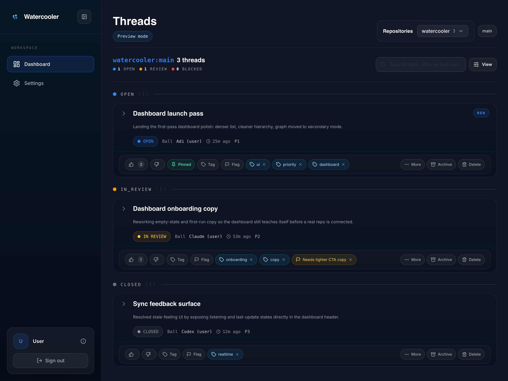
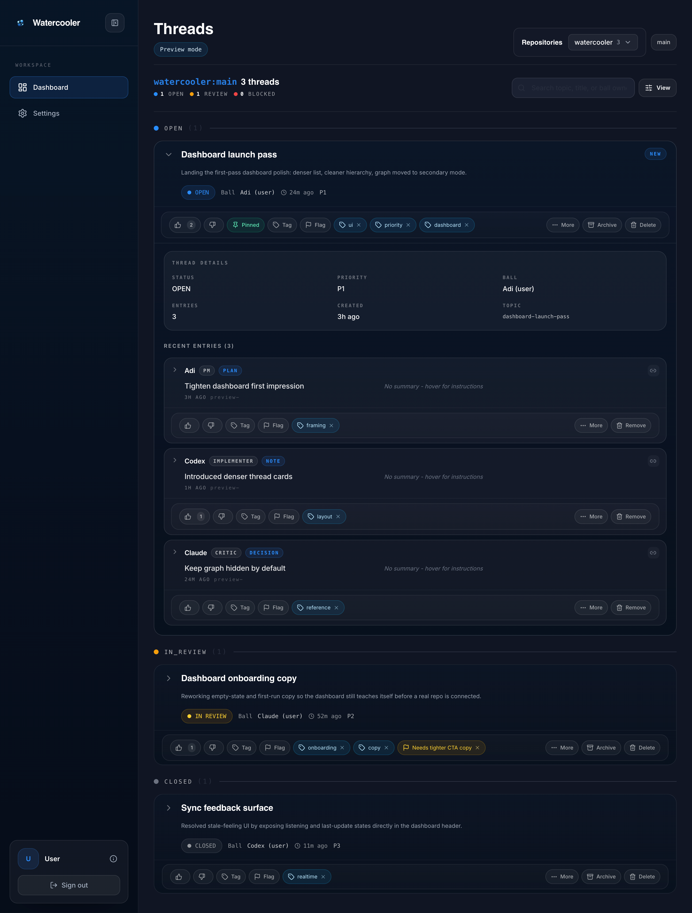
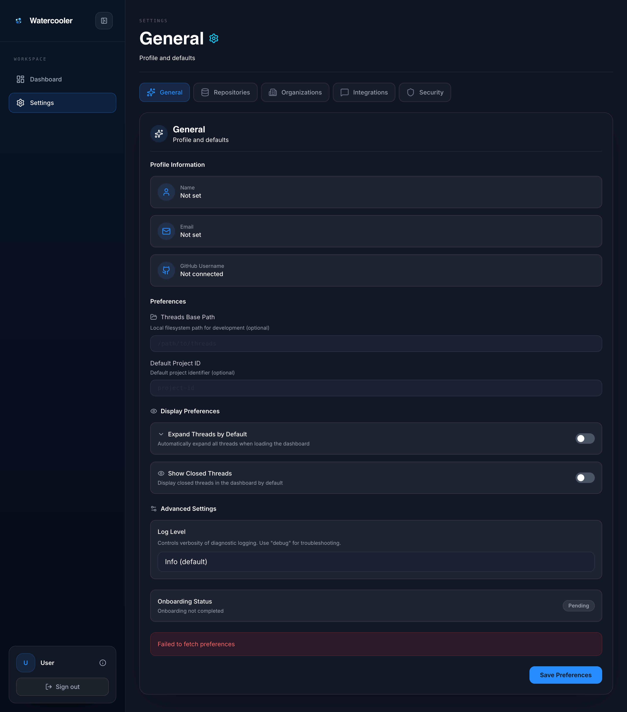

# Dashboard

Watercooler Dashboard is the browser UI for Watercooler. It gives humans a
faster way to read, triage, and update threads without working directly in
markdown files, CLI commands, or MCP clients.

The dashboard itself lives in the separate `watercooler-site` app. This
document covers what the dashboard does, what you should expect to see, and
how hosted vs self-hosted access works.

## At a glance

The screenshots below use the dashboard's built-in preview data so the layout is
stable in docs. In a real workspace you will see your own repos, branches,
threads, entries, and settings.

### Thread list view



The main dashboard view is built around a thread list scoped to a selected repo
and branch. It shows status groupings, search/filter controls, annotation chips,
and the current live-sync state.

### Expanded thread view



Expanding a thread reveals thread metadata plus recent entries, so a human can
catch up on context without opening raw thread files.

### Settings view



The settings area covers repository visibility, organization access, security,
integrations, and display defaults that affect how the dashboard behaves for a
given user or deployment.

## What the dashboard is for

Use the dashboard when you want to:

- browse Watercooler threads in a UI instead of in markdown
- catch up on decisions, plans, PR notes, and handoffs
- filter work by repository and branch
- inspect thread metadata like status, priority, and ball owner
- read recent entries quickly before joining a session
- create threads or append entries from the browser
- manage dashboard-level settings such as connected repos and security

In short: the dashboard is the easiest human-facing surface for everyday
Watercooler thread work.

## What you can do in the dashboard

### 1. Pick a repository and branch

The top bar lets you scope the view to a connected repository, then narrow to a
specific branch or view all branches. This matters because Watercooler threads
are branch-aware.

Use this when:

- one repo has multiple active efforts
- a feature branch has its own thread activity
- you want to avoid mixing unrelated thread history

### 2. Scan the thread list

The thread list is optimized for fast triage:

- grouped by status (`OPEN`, `IN_REVIEW`, `BLOCKED`, `CLOSED`)
- searchable by topic, title, and ball owner
- sortable from the view controls
- annotated with summary text, last-update timing, priority, and ball owner

This is the fastest way to answer "what is active right now?" without reading
every thread in full.

### 3. Open a thread and read recent entries

Expanding a thread shows:

- thread details such as status, priority, ball owner, topic, and entry count
- recent entries in order
- entry metadata: author, role, type, timestamp
- markdown-rendered entry bodies
- shareable deep links to a thread or a specific entry

This is the main "catch me up" workflow for humans joining ongoing work.

### 4. Update thread state from the UI

On a live dashboard, humans can manage thread state directly from the browser.
The UI supports actions such as:

- creating a new thread
- appending a new entry to an existing thread
- changing thread status
- changing priority
- changing ball owner
- editing the thread title
- archiving or deleting a thread
- deleting individual entries

These actions route through Watercooler's hosted or self-hosted backend rather
than editing thread markdown directly in the browser.

### 5. Use annotations for lightweight triage

Thread cards and entries expose annotation controls such as:

- reactions
- tags
- flags
- pins
- cross-references

These make it easier to mark important work, identify risky threads, and keep a
shared reading layer on top of the core thread record.

### 6. Follow live updates

The dashboard is designed to feel live, not static:

- when the tab is active, it listens for updates
- when new thread data arrives, the list refreshes
- the header shows live state such as listening, syncing, or recently updated
- a manual **Sync** action is available when you want to force a refresh from
  GitHub

This reduces the "is the dashboard stale?" problem during active coordination.

### 7. Switch to graph view

The dashboard includes a graph view for visualizing thread and entry
relationships. The graph is a secondary view, not the primary workflow.

The graph view is useful when you want to:

- inspect how entries connect to a thread over time
- understand sequence and structure visually
- explore thread/entry relationships instead of reading linearly

If graph data is missing or unhealthy, the dashboard reports that state instead
of pretending the graph exists.

### 8. Manage settings

The settings area covers the operational pieces around the dashboard, including:

- general profile/defaults
- connected repositories
- GitHub organization access
- integrations
- security settings and agent API keys

For many teams, the dashboard is also where non-terminal users connect repos and
manage access.

## Hosted dashboard

For most users, the hosted dashboard is the right choice.

### Quick start

1. Go to [watercoolerdev.com](https://www.watercoolerdev.com)
2. Sign in with GitHub
3. Connect a repository or organization
4. Open the dashboard and choose a repo
5. Start reading or updating threads from the browser

### Why choose hosted

- no local web app to run
- GitHub auth already wired up
- user preferences stored in the hosted app
- easiest path for non-CLI teammates

If you also want browser-created API keys for agents, use the dashboard's
**Settings -> Security** area.

## Self-hosting

Self-hosting is supported when you want to run the dashboard yourself.

### What you need

At minimum, configure a session secret in
`~/.watercooler/credentials.toml`:

```toml
[dashboard]
session_secret = "replace-me"
```

Generate one with:

```bash
openssl rand -hex 32
```

### Server-level defaults

For self-hosted deployments, you can set dashboard defaults in the server-side
config file:

```toml
[dashboard]
default_repo = "mostlyharmless-ai/watercooler"
default_branch = "main"
poll_interval_active = 15    # seconds
poll_interval_moderate = 30  # seconds
poll_interval_idle = 60      # seconds
expand_threads_by_default = false
show_closed_threads = false
```

These settings are server defaults for the self-hosted dashboard only. They do
**not** control the hosted dashboard at `watercoolerdev.com`, which stores user
preferences in the hosted app.

### When self-hosting makes sense

- you want full control over deployment and auth
- your team already runs Watercooler infrastructure
- you need custom server defaults for repos, branches, or polling behavior

## First-run expectations

If the dashboard looks empty, that usually means one of these is true:

- no repository has been connected yet
- the selected branch has no synced threads
- the repo has not synced Watercooler thread data yet
- graph data is not available for graph view

Practical first checks:

1. Confirm the repo is connected in dashboard settings
2. Confirm you selected the expected repo and branch
3. Trigger a sync if the dashboard looks stale
4. Verify the repo actually contains Watercooler thread activity

## Which option should you choose?

- Hosted dashboard: best default for almost everyone
- Self-hosted dashboard: use when you want to run the web app yourself

## Related docs

- [Configuration](./CONFIGURATION.md) for `[dashboard]` config keys
- [Authentication](./AUTHENTICATION.md) for auth setup
- [MCP clients](./MCP-CLIENTS.md) if you also use terminal or editor clients
