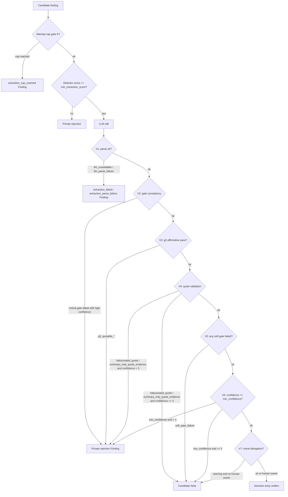

# Decision gates

The Decision Extractor daemon evaluates every candidate entry through two
layers of gates before it will write a Decision entry to a thread. The purpose
of this system is to resist **retroactive authority laundering** — the failure
mode where a summary, a hope, or a half-formed plan gets promoted into
something that reads like a committed decision when it never was.

The guiding question behind every gate is:

> Would the original author recognise this as their decision?

If the answer is anything other than yes, the candidate is rejected or deferred
for human review. A Decision entry that emerges from this pipeline is a claim
the system is willing to stand behind, because it can be traced back to
recognisable words from a real author at a real moment. A high rejection rate
is a sign the gate is working, not a sign something is wrong.

---

## The two layers

**Layer 1 — LLM-evaluated 8-gate checklist.** The LLM is given the candidate
entry and recent thread context. It evaluates each gate and returns `{passed,
reason}` per gate plus a 0–5 confidence score. Four of the eight gates are
"hard" (failure means private rejection); four are "soft" (failure surfaces a
thread-visible candidate Note for human review instead of silently dropping the
entry).

**Layer 2 — Deterministic pipeline gates.** These wrap the LLM call and run
in a fixed order. Some are pre-LLM checks (attempt caps, detector-score
threshold). The rest are post-LLM validators (parse checks, gate-consistency
enforcement, verbatim-quote cross-reference). They exist because LLM output
cannot be trusted without structural corroboration.

---

## The 8-gate checklist

Defined in `SYSTEM_PROMPT` at `decision_extraction.py:162`. The LLM evaluates
all eight gates and returns a structured result for each.

| Gate | Class | What it checks |
|---|---|---|
| `g1_commitment` | HARD | An explicit choice was made — "we decided", "the plan is", "we will", or explicit Decision entry type. Speculative language is rejected. |
| `g2_not_superseded` | HARD | Later entries in the thread do not contradict or narrow this decision. |
| `g3_quotable` | HARD | One or more sentences can be quoted verbatim from the source entry supporting the decision. Also enforced separately by the deterministic quote-validation gate. |
| `g4_rationale` | SOFT | The "why" is stated in the entry or immediately adjacent context. Confidence is capped at 3 if the rationale is inferred from distant context. |
| `g5_scope` | SOFT | Scope is bounded (repo, subsystem, feature) and not only inferred. |
| `g6_temporal` | SOFT | Temporal context exists — provisional, final, or timeboxed. |
| `g7_authority` | HARD | Would the original author recognise this as their decision? Called "the most critical check" in the prompt — extraction records decisions, it does not arbitrate them. |
| `g8_self_contained` | SOFT | The trace survives deletion of surrounding context and would not mislead a future reader without the rest of the thread. |

### Hard vs soft failure

The partition is defined as constants at `decision_extraction.py:99–108`:

```python
HARD_FAIL_GATES = frozenset({"g1_commitment", "g2_not_superseded",
                              "g3_quotable", "g7_authority"})
CANDIDATE_FALLBACK_GATES = frozenset({"g4_rationale", "g5_scope",
                                       "g6_temporal", "g8_self_contained"})
```

- **HARD gate failure** → private rejection Finding (category
  `extraction_rejected_hard_gate` or `extraction_rejected`). The failure is not
  visible in the thread. The entry is gone from the pipeline.
- **SOFT gate failure** → candidate Note written to the thread
  (`Candidate-Status: needs_human_confirmation`). A human can review the note
  and promote it to a Decision if it is substantively correct. See
  [Candidate Notes and Promotion](CANDIDATE_NOTES.md).

The function `classify_gate_outcome()` (`decision_extraction.py:807`) returns
the strictest label for a result set: `hard_fail` if any hard gate failed;
`candidate_fallback` if only soft gates failed; `pass` otherwise.

### The g8 demotion

g8 (`g8_self_contained`) was previously a critical (hard-fail) gate. It was
deliberately demoted to soft/candidate-fallback (`decision_extraction.py:103`).
The rationale: an entry that might mislead without context is worth surfacing to
a human reviewer rather than silently discarding. Demotion means
self-contained-ambiguity is visible, not silently dropped.

### The _CRITICAL_GATES alias

`_CRITICAL_GATES = frozenset({"g1_commitment", "g2_not_superseded",
"g7_authority"})` (`decision_extraction.py:112`) is an internal subset used
only by the gate-consistency check (Layer 2, step 4 below). It excludes g3
because g3 has its own enforcement block with a richer rejection-reason taxonomy
that the consistency check does not need to cover.

---

## Deterministic pipeline gates

These gates execute in a fixed order and do not depend on LLM judgment. They
provide structural corroboration and abuse-prevention around the LLM call.

### Pre-LLM gates

These execute before any LLM call is made for a given candidate.

**Gate P1 — Attempt-cap gate** (`decision_extractor.py:583`, comment "P1.3")

Before any LLM or write work is performed, the daemon checks whether this
candidate has already exhausted its budget:

- LLM attempts >= `max_extraction_attempts` → emit `extraction_cap_reached`
  and skip permanently.
- Write-failure attempts >= `max_write_failure_attempts` → emit
  `extraction_cap_reached` and skip permanently.

This prevents runaway LLM spend on consistently failing candidates.

**Gate P2 — Detector-score gate**

A candidate is only eligible for the candidate-Note path when its upstream
Decision Detector NLP score is at or above `min_extraction_score` (config
default 4). Candidates below this floor are not considered for candidate-Note
routing regardless of their LLM result. This gate controls which entries reach
the LLM at all.

### Post-LLM validation gates

These execute after the LLM responds, in strict order
(`decision_extraction.py` ~`:565`–`:719`).

**Gate V1 — LLM availability and parse**

Two distinct failure shapes, both hard stops:

- `llm_unavailable` — the LLM returned null (no response).
- `llm_parse_failure` — the LLM response could not be parsed as valid JSON
  matching the expected schema.

**Gate V2 — Gate-consistency check** (`_validate_gate_consistency`,
`decision_extraction.py:513`)

If any gate in `_CRITICAL_GATES` (g1, g2, g7) is marked `passed: false` by
the LLM but the LLM also returned `confidence >= 3`, the result is
force-rejected. Rejection reason: `critical_gate_<name>_failed_with_confidence_<n>`.

This catches LLM self-contradiction. Claiming high confidence while reporting
a critical gate failure is inconsistent and signals an unreliable response.

**Gate V3 — g3_quotable fail-closed enforcement** (issue #481,
`decision_extraction.py:615`)

g3 must be an affirmative pass verdict from the LLM. Every non-affirmative
shape is classified separately for telemetry:

| Rejection reason | Cause |
|---|---|
| `g3_quotable_missing` | Gate key absent from LLM response. |
| `g3_quotable_malformed` | Gate present but not a dict, or no `passed` key. |
| `g3_quotable_not_evaluated` | Parser-injected default (`passed=false, reason="not evaluated"`). |
| `g3_quotable_failed` | LLM explicitly reported `passed: false`. |

The missing and malformed branches are unreachable today because `_parse_llm_response`
normalises every expected gate to a `{passed, reason}` dict. They exist as
defense-in-depth: if the parser changes, a future shape cannot crash the
pipeline — it will be classified and rejected.

**Gate V4 — Quote validation** (`_validate_quotes`, `decision_extraction.py`
~`:660`)

Verbatim quotes must be byte-exact (case-sensitive) substrings of the candidate
entry body. Whitespace and common Unicode punctuation are normalised before
matching, but the match is otherwise strict.

| Rejection reason | Cause |
|---|---|
| `hallucinated_quote` | Quote not found anywhere in the source entry body. |
| `summary_only_quote_evidence` | Quote matched only the paraphrased summary text that was sent to the LLM for oversized bodies, not the source body itself. A summary is a paraphrase, not source evidence. |

**Gate V5 — Soft-gate routing** (`decision_extraction.py:685`)

If any of g4, g5, g6, or g8 failed (and all hard gates passed), the result is
returned with `rejection_reason="soft_gate_failure"`. The daemon routes this to
a candidate Note rather than a private rejection.

**Gate V6 — Confidence threshold** (`decision_extraction.py:707`)

If confidence < `min_confidence` (config default 3), the candidate is rejected
as `low_confidence_<n>` where `n` is the actual score. Extractions with
confidence below 3 are not eligible for the candidate-Note path — they are
discarded as private rejections.

**Gate V7 — Moral-delegation gate** (comment "e0", issue #880,
`decision_extractor.py:932`)

A gate-passing, high-confidence extraction whose decision statement carries a
value or ethical judgment must not be auto-written as an authoritative Decision
merely because confidence is high. Auto-writing would launder a value judgment
into authority with no accountable human. The gate routes the candidate to a
candidate Note instead, unless the source entry itself already records explicit
human ownership (`human_authorized_by` field).

The check is **procedural** (is there an accountable human and proper process?)
and not a judgment about whether the decision is morally right.

Detection uses a two-tier classifier (`classify_moral_delegation` in
`decision_extraction.py`):

- **Tier 1** — explicit ethical vocabulary ("ethical", "morally", "the right
  thing to do", "moral duty"). These effectively never appear in non-moral
  technical text, so any match always flags.
- **Tier 2** — a value noun or transgression verb bound to a human or social
  object ("user consent", "privacy of patients", "deceive customers"). The
  binding is what discriminates `preserve user consent` (flags) from
  `this harms throughput` or `fairness of the scheduler` (does not flag).

The classifier is intentionally conservative. Over-firing trains reviewers to
dismiss the warning, which re-enables the exact authority-laundering path the
gate exists to close.

Rejection reason: `moral_delegation_warning`. When the source entry carries
explicit human ownership and the moral-delegation check fires, the daemon still
direct-writes the Decision (`decision_extractor.py:993–1008`): it copies the
accountable human into the Decision's `human_authorized_by` field, sets the
`authority_basis` metadata to `human_endorsed`, and stamps a
`Moral-Delegation-Warning: true` marker into the Decision body. This lets an
audit distinguish an owned, value-laden extraction from an ordinary daemon
extraction. The writing actor stays `daemon`; the human named in
`human_authorized_by` owns the value judgment (actor is not authority).

---

## Where a candidate ends up

Every candidate reaches exactly one of three terminal destinations.



### Decision entry written

The candidate passed all hard gates, all soft gates, the confidence threshold,
the quote-validation gate, and either had no moral-delegation concern or the
source entry carried explicit human ownership. A `Decision` entry is written
to the originating thread. Finding category: `extraction_success`.

### Candidate Note

The candidate failed a soft gate, or scored low-confidence (but >= 3), or had
quote-validation issues at confidence >= 3, or triggered the moral-delegation
gate without a human owner on the source entry — and its detector score is at
or above `min_extraction_score`. A thread-visible Note is written with
`Candidate-Status: needs_human_confirmation`. A human (or human-authorized
agent) can promote it to a Decision via `watercooler_promote_candidate` or
reject it via a `CandidateDisposition` Note. Finding category:
`extraction_candidate_note`. See [Candidate Notes and Promotion](CANDIDATE_NOTES.md).

The candidate-Note eligibility logic is at `decision_extractor.py:860`:

```python
is_candidate_eligible = (
    rr == "soft_gate_failure"
    or (rr.startswith("low_confidence_") and confidence >= 3)
    or (rr in ("hallucinated_quote", "summary_only_quote_evidence") and confidence >= 3)
) and detector_score >= cfg.min_extraction_score
```

### Private rejection Finding

Any hard-gate failure, any result below the confidence floor, or any result not
eligible for the candidate-Note path lands here. No thread-visible output is
produced. Finding category: `extraction_rejected` (or
`extraction_rejected_hard_gate` when `classify_gate_outcome` returns `hard_fail`).

---

## Rejection-reason reference

Use this table when reading `extraction_rejected` or `extraction_rejected_hard_gate`
findings from `watercooler_daemon_findings`.

| Rejection reason | Gate layer | Cause | Outcome |
|---|---|---|---|
| `llm_unavailable` | V1 | LLM returned null | Private rejection |
| `llm_parse_failure` | V1 | LLM response not parseable as valid JSON | Private rejection |
| `critical_gate_<name>_failed_with_confidence_<n>` | V2 | A critical gate (g1/g2/g7) failed but confidence was >= 3 | Private rejection |
| `g3_quotable_missing` | V3 | `g3_quotable` key absent from LLM response | Private rejection |
| `g3_quotable_malformed` | V3 | `g3_quotable` not a dict or has no `passed` key | Private rejection |
| `g3_quotable_not_evaluated` | V3 | Parser default injected (`reason="not evaluated"`) | Private rejection |
| `g3_quotable_failed` | V3 | LLM explicitly reported `g3_quotable.passed: false` | Private rejection |
| `hallucinated_quote` | V4 | Quote not found in source entry body | Private rejection (or candidate Note if confidence >= 3) |
| `summary_only_quote_evidence` | V4 | Quote matched summary paraphrase, not source body | Private rejection (or candidate Note if confidence >= 3) |
| `soft_gate_failure` | V5 | g4, g5, g6, or g8 failed; hard gates passed | Candidate Note |
| `low_confidence_<n>` | V6 | Confidence below `min_confidence`; `n` is the score | Candidate Note if n >= 3; private rejection if n < 3 |
| `moral_delegation_warning` | V7 | Value/ethical judgment, no human owner on source entry | Candidate Note |
| `extraction_cap_reached` | P1 | LLM or write-attempt budget exhausted | `extraction_cap_reached` Finding (not in rejection category) |

The `extraction_cap_reached` finding category is distinct from rejection — it
signals a permanently-skipped entry rather than a validity judgment.

---

## Relevant configuration knobs

These keys live under `[mcp.daemons.decision_extractor]` in your config. See
[Daemons](DAEMONS.md) and [Configuration](CONFIGURATION.md) for the full table.

| Key | Default | Gate it controls |
|---|---|---|
| `min_extraction_score` | 4 | P2 (detector-score gate) and candidate-Note eligibility |
| `min_confidence` | 3 | V6 (confidence-threshold gate) |
| `max_extraction_attempts` | 3 | P1 (LLM attempt cap) |
| `max_write_failure_attempts` | 5 | P1 (write-failure cap) |
| `max_extractions_per_day` | 20 | Daily rate cap (not a validity gate) |

`max_extractions_per_day` is a cost-control ceiling, not a validity gate — it
pauses processing for the rest of the calendar day once the cap is reached
(`extraction_rate_limited` finding). It does not affect which candidates pass
or fail the gate logic.

---

## Related documentation

- [Daemons](DAEMONS.md) — Decision Extractor configuration, finding categories,
  and LLM setup
- [Candidate Notes and Promotion](CANDIDATE_NOTES.md) — candidate Note body
  shape, promotion via MCP tool or CLI, failure modes
- [Authority Ladder](AUTHORITY_LADDER.md) — the three-level human-authority
  model that frames why Level 3 acts (Decision, Closure, supersession) require
  explicit human direction
