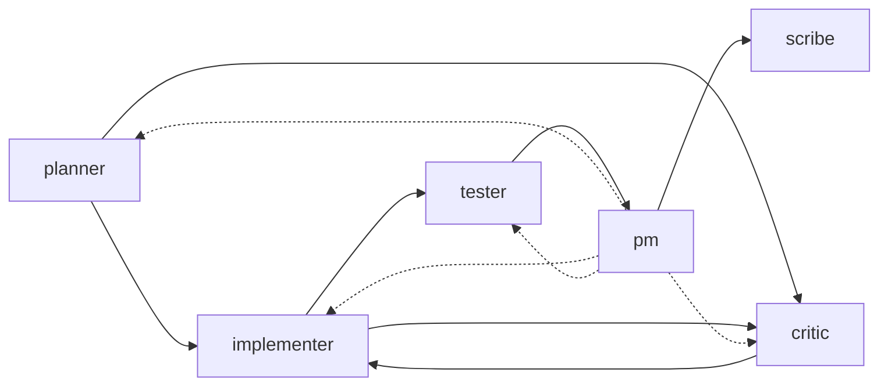

# Roles and Role Creation

Every thread entry in Watercooler carries a role — a label that answers one question: "What kind of contribution is this?" Roles make your project history searchable, auditable, and analytically meaningful. This guide covers what roles are, how the six built-in roles work together, and how to define custom roles for your team. For the quick reference (field list and a minimal example), see [CONFIGURATION.md](./CONFIGURATION.md#custom-roles-watercoolerrolestoml). This document is the full treatment.

---

## What a role is

A role is a **collaborative stance** — a declaration of what kind of thinking produced an entry. Roles are per-entry, not per-agent. The same human can wear `planner` for one entry and `implementer` for the next. The same AI agent can enter `critic` mode for a code review and `scribe` mode to record the outcome. What the role marks is the nature of the contribution, not the identity of the contributor.

The canonical framing from `.watercooler/roles.toml`:

> The role answers: "What kind of contribution is this entry making to the project record?" — not "What physical action is the agent literally performing right now?"

That distinction matters more than it first appears. A `tester` entry doesn't require tests to be running at the moment of writing — it marks that the contribution is validation-oriented: a test plan, a report of observed results, a summary of coverage gaps. An `implementer` entry doesn't require code to be typed — it marks that the contribution is execution-facing: changes recorded, blockers surfaced, remediation described. A `scribe` entry may come from a human, an AI agent, or an automated daemon — what matters is the function: preserving the record without introducing new direction.

This is the deeper point: **roles separate types of thinking**. The hardest challenge in collaborative work — human or AI-assisted — is knowing what *kind* of contribution the moment calls for. Should the next step establish direction, or challenge the direction already there, or execute against it, or verify the execution? Roles make that question explicit and durable. A `planner` entry records that direction-setting mode was active. A `critic` entry records that challenge mode was active. This separation keeps threads from collapsing into undifferentiated discussion, and it keeps agents from doing everything at once — proposing, building, testing, and critiquing in a single response, which makes the record unreadable and the collaboration incoherent.

**Roles also create coordination without presence.** In asynchronous, multi-agent work, you often pick up a thread without knowing what state it's in. The role distribution of recent entries tells you. If the last several entries are `implementer`, execution is in progress. If they're `critic`, something is under review. If they're `pm`, coordination is active. This is orientation without real-time communication — which is exactly what's needed when humans, AI agents, and automated daemons all contribute to the same thread across sessions and time zones.

---

## Why roles matter

**They give the record structure that can be read.** Without roles, a thread is a sequence of messages. With roles, it's a structured record of how work happened — what kind of thinking produced each step, how direction was established, how it was challenged, how it was built, how it was verified. A new participant — human or AI, joining the project days or months later — can orient quickly: where is the proposal? (`planner` entries) Where is the challenge? (`critic`) Where is the execution? (`implementer`) Where did it land? (`scribe`, `Closure` entries) This isn't just searchability — it's the difference between a log and a record.

**They make critique visible.** The `critic` role deserves particular attention in AI-assisted development. AI agents tend toward affirmation and construction rather than challenge. Critique is easy to collapse into implementation, easy to skip under time pressure, easy to omit when the agent is confident. When critique has its own role, it shows up in the record — or its absence does. A feature thread with no `critic` entries is a visible signal that review may have been skipped. A project where `critic` entries exist but never generate follow-up `implementer` entries suggests findings are being recorded but not acted on. Neither of these patterns is legible without role structure.

**They enable accountability at the contribution level.** A `planner` Decision entry records that direction was set, and what it was. A `critic` Note records that a concern was raised, by whom, and what it was. A `tester` Note records what was verified, under what conditions, and with what result. This is accountability for the *kind of thinking* applied to the project — not just who typed which message. For AI-assisted work in particular, where "who contributed" is often several agents across several sessions, role attribution is what makes the record auditable and the project's epistemic history reconstructible.

**They make project health machine-readable.** Because roles are structured, Watercooler can analyze them. One built-in rule (R06): if more than 70% of entries across your project carry `implementer` with fewer than 10% carrying `critic`, the system flags potential review debt. This signal is visible in `watercooler_pulse_snapshot`. This kind of analysis is only possible because roles give the record a consistent semantic structure — without them, the system can only search text, not reason about what kind of work was done.

**They encode team epistemology as convention.** Custom roles go beyond tagging — they're a documented answer to the question "what does this kind of contribution mean on our project?" A `security-audit` role with explicit `instructions`, `boundary`, and `handoff_to` fields defines not just a label but a practice: what a security review looks like, what it covers, what it doesn't, and what happens next. When that file is committed to the repository, it becomes a shared convention that every contributor and every AI agent working in the repo can consult.

> **Note:** Pattern detection operates on the six canonical role names only. Custom roles are counted by their exact name in search and display, but are not currently mapped through `canonical_role` for analytics rollups. If analytics coverage for custom roles matters to your team, track usage via `watercooler_search(role="security-audit", ...)` directly.

---

## The six canonical roles

Watercooler ships six roles that cover the full arc of a software project. Most teams never need more.

Entry types classify the nature of a thread entry: `Note` for updates and findings, `Plan` for proposals, `Decision` for binding choices, `PR` for pull-request links, `Closure` for wrap-ups. Roles and entry types are independent — a `planner` entry with type `Decision` means "a direction has been committed"; a `critic` entry with type `Note` means "a finding was recorded."

| Role | What it records | Typical entry types | Hands off to |
|------|-----------------|---------------------|--------------|
| `planner` | Direction: what to build, why, under what constraints | Plan, Decision | implementer, critic, tester, pm |
| `critic` | Review by inspection: issues, risks, quality concerns | Note, Decision | implementer, tester, planner |
| `implementer` | Implementation: changes made, blockers, PR-ready state | Note, PR | tester, critic, planner |
| `tester` | Validation: test plans, observed results, coverage, readiness | Plan, Note | implementer, critic, pm |
| `pm` | Coordination: sequencing, ownership, blockers, status | Plan, Note | all roles, scribe |
| `scribe` | Record-keeping: decisions captured, summaries, closures | Decision, Closure, Note | (terminus) |

### planner

Proposes what to build and how — architecture, design direction, constraints, and trade-offs.

Wear `planner` when the contribution is about technical direction: what to build, how to structure it, what forces are in tension, and which path to take. Use `Plan` entries for open proposals and design options. Use `Decision` when a direction has actually been committed.

**Boundary:** Direction, not logistics. `planner` does not manage timelines, handoffs, or ownership — that is `pm`. It does not record implementation progress or review findings.

### critic

Inspects and challenges code, designs, and claims — issues, risks, ambiguities, quality concerns.

Wear `critic` when the contribution is review by reading or reasoning: code review, design critique, risk analysis, or security audit by inspection. Be specific — point to the exact artifact or claim at issue, explain the risk, and state what follow-up is needed. Record the finding, then hand off to `implementer` for fixes or to `tester` for dynamic validation.

**Boundary:** Review, not execution. `critic` does not run tests (that's `tester`) and does not implement fixes (that's `implementer`).

### implementer

Contributes implementation work — code changes, concrete fixes, blockers, and PR-ready state.

Wear `implementer` when the contribution is about building or modifying the solution. This includes recording changes already made, describing what is blocked in the code, or surfacing an implementation ambiguity discovered while working. The key is that the contribution is implementation-facing, not that code is being typed in the same instant.

**Boundary:** Execution, not direction. When you encounter a design ambiguity that materially affects the solution, surface it as an `implementer` entry and let `planner` weigh in — don't silently make architecture choices.

### tester

Contributes validation evidence and judgment — test strategy, test plans, observed results, coverage, regression risk, and acceptance status.

Wear `tester` when the contribution is about verification. Use `Plan` entries for test plans and strategy before execution. Use `Note` entries for observed results, acceptance status, regressions, and coverage gaps. Separate observation from interpretation: state what was checked, under what conditions, and with what result.

**Boundary:** Verification, not review. `tester` does not review code primarily by inspection — that's `critic`. If evidence points to a design flaw, report the validation signal and hand off rather than collapsing validation and design critique into one step.

### pm

Coordinates who does what and when — sequencing, handoffs, blockers, ownership, and status.

Wear `pm` to keep work moving: surface blockers, track dependencies, sequence tasks, clarify ownership, and summarize where the thread stands. When a thread stalls, diagnose the coordination problem and propose the next step. Use `Plan` entries for coordination structure; use `Note` entries for status updates and ownership clarifications.

**Boundary:** Coordination, not technical direction. `pm` does not decide what to build or how — that's `planner`. It does not substitute for review or validation. Keep `pm` narrow: its job is to make responsibility, sequence, and project state visible.

### scribe

Records and normalizes project memory — decisions, summaries, closures, and extracted outcomes.

Wear `scribe` when the contribution is to preserve what has already happened: record a decision, summarize a thread, close out work, or make the project record more durable. A `scribe` entry may be authored by a human or by an automated daemon. What matters is the function: preserving and normalizing the record without laundering new authority into it.

**Boundary:** Record-keeping, not direction. `scribe` does not introduce new technical direction, collapse disagreement into false consensus, or upgrade ambiguous discussion into a binding decision. `scribe` is typically the last role in a thread arc — it is a terminus, not a stepping stone.

---

For the complete behavioral guidance — `instructions`, `entry_style`, and `when_to_use` for each role — call `watercooler_role_details(code_path=".", role="<name>")` to retrieve the full spec. If your project has a `.watercooler/roles.toml` file (many do), it contains the annotated role definitions and is designed to be read directly. If not, the bundled definitions live in the package at `src/watercooler/data/roles.toml`.

---

## How roles collaborate

Roles are designed to hand off cleanly to each other. The `handoff_to` field in each role definition encodes the typical next step. A well-structured thread follows a recognizable arc:



The common arcs in practice:

- **Feature development**: `planner` proposes direction → `implementer` builds → `critic` reviews → `implementer` revises → `tester` validates → `pm` confirms readiness → `scribe` records closure.
- **Design review**: `planner` proposes → `critic` challenges → `planner` revises → repeat until committed.
- **Bug fix**: `implementer` reports blocker → `critic` diagnoses root cause → `implementer` fixes → `tester` verifies.
- **Coordination**: `pm` sequences work, routes blockers, and threads through any arc as needed.

The `pm` role is unusual because it can appear at any point in the arc — its job is to keep work moving, not to fit into a fixed slot.

**Role balance matters.** Watercooler tracks role distribution across your project and can flag imbalances automatically. A project where the vast majority of entries are `implementer` with very little `critic` presence is a signal that review may have been skipped. A healthy project record shows a mix of roles that reflects the full development cycle — not a perfect ratio, but a recognizable arc from planning through closure.

**The ball.** Watercooler tracks whose turn it is to act with a concept called the "ball." The `--ball` flag on write commands and the `watercooler_handoff` tool pass the ball from one contributor to another. `pm` entries often facilitate these handoffs explicitly. See [TOOLS-REFERENCE.md](./TOOLS-REFERENCE.md) for how `watercooler_ack` and `watercooler_handoff` manage ball ownership.

---

## Creating a custom role

Before defining a custom role, ask whether one of the six canonical roles fits. Custom roles add explanation overhead for new contributors, and the canonical six cover the full project lifecycle for most teams.

You need a custom role when a recurring contribution type doesn't map cleanly to any canonical role. Common examples: `security-audit` (a specialized variant of `critic`), `data-analyst` (specialized `tester`), `devops` (specialized `implementer`). If you can describe the role clearly as "a `critic` that focuses on X," that mapping is exactly what the `canonical_role` field is for.

### Step 1: Create `.watercooler/roles.toml`

Create the file in your project repository root if it doesn't already exist. The project file is **merged with the bundled defaults at the role level**: new role names you add become available alongside the six canonical roles. Any role name that appears in your file **replaces** its bundled counterpart in its entirety — field-level merging is not supported.

> **Important:** If you include a `[roles.planner]` section in your project file, it replaces the bundled `planner` definition completely. Any field you omit will be empty, not inherited from the bundled version. When overriding a canonical role, include every field you want to preserve.

### Step 2: Define your role

**Minimal definition** (three strongly recommended fields):

```toml
# .watercooler/roles.toml

[roles.security-audit]
description    = "Review code and configs for security vulnerabilities"
canonical_role = "critic"
produces       = ["Note", "Decision"]
```

This is valid and immediately usable. Watercooler will accept `security-audit` as a role on any write command.

**Full definition** (all fields, annotated):

```toml
[roles.security-audit]
# Recommended: what this role contributes — shown in watercooler_roles() output
description    = "Review code and configs for security vulnerabilities"

# Recommended: which canonical role this maps to (for documentation; analytics uses literal names).
# Should be one of: planner, critic, implementer, tester, pm, scribe
# Defaults to the role name itself if omitted.
canonical_role = "critic"

# Recommended: entry types this role typically creates (advisory, not enforced).
# Valid values: Note, Plan, Decision, PR, Closure
produces       = ["Note", "Decision"]

# Recommended: what this role does NOT do — helps agents self-correct
boundary       = """
Does not implement fixes — that belongs to implementer.
Does not run dynamic tests — that belongs to tester.
Does not perform sustained automated auditing — that belongs to daemon infrastructure.
"""

# Recommended: roles this role commonly hands off to
handoff_to     = ["implementer", "pm"]

# Recommended: behavioral guidance for agents wearing this mask.
# Write this as if briefing a collaborator on how to act in this stance.
instructions   = """
Focus on input validation, authentication, authorization, secrets handling,
and dependency risks. Cite exact file paths and line numbers. Classify each
finding by severity: critical, high, medium, or low.

Use Note entries for findings. Use Decision only when a finding results in
a committed mitigation or explicit acceptance of risk.

Keep a clear boundary between observing problems and solving them.
If dynamic evidence is needed, hand off to tester.
If implementation is needed, hand off to implementer.
"""

# Optional: how to structure entry bodies in this role
entry_style    = """
Lead with severity classification. List findings with artifact citations
(file path, line number). Close with recommended next steps and handoff target.
"""

# Optional: when to choose this role instead of the canonical critic
when_to_use    = """
Wear this mask when the primary purpose is security-oriented review:
threat modeling, vulnerability analysis, secrets audit, or dependency risk.
For general code review, use critic instead.
"""

# Optional: which roles this role works alongside
collaborate_with = """
Pairs with implementer (to fix findings) and pm (to prioritize by severity).
Receives code and designs from planner and implementer.
"""
```

**Full override of a canonical role** — when you need to adapt a built-in role's behavior. Because a project role entry replaces its bundled counterpart entirely, include all fields you want to keep:

```toml
# .watercooler/roles.toml
# Override planner to require ADR format. Every field you want to preserve must be included;
# omitted fields will be empty — they are NOT inherited from the bundled definition.

[roles.planner]
description    = "Propose what to build and how — architecture, design direction, constraints, and trade-offs."
canonical_role = "planner"
produces       = ["Plan", "Decision"]
boundary       = """
Owns direction, not logistics. Does not manage timelines, handoffs, ownership,
or status tracking — that belongs to the pm role.
"""
handoff_to     = ["implementer", "critic", "tester", "pm"]
instructions   = """
Use Architecture Decision Records (ADR) format for all plan entries.
Structure: Context → Options → Decision → Consequences.
"""
```

### Step 3: Commit the file

`.watercooler/roles.toml` is a team contract — commit it to the repository so every contributor and every AI agent working in the repo shares the same role vocabulary.

### Requirements summary

- Missing fields silently default to empty strings or empty lists — the loader does not reject a role with missing fields. The only enforced write-time check is that the role **name** exists in the active set. See the "Enforced vs advisory" table in the Field reference section for the full picture.
- `canonical_role` should be one of the six canonical names. If omitted, it defaults to the role name itself (e.g., `security-audit`), which is not a canonical name — analytics that filter on canonical roles will not include entries from this custom role.
- **Use lowercase in TOML role keys.** Role names from `.watercooler/roles.toml` are stored exactly as written. Write-time validation lowercases the incoming role value before lookup, so `[roles.Security-Audit]` in TOML would not match a write call with `role="security-audit"`. Stick to `[roles.security-audit]`.
- Multi-line string fields use TOML triple-quote syntax (`""" ... """`), which is the recommended form for `instructions`, `boundary`, and `entry_style`.

---

## Field reference

| Field | Required | Type | Purpose |
|-------|----------|------|---------|
| `description` | Recommended | string | One-line summary shown in `watercooler_roles()` output; defaults to `""` if omitted |
| `canonical_role` | Recommended | string | Documents which canonical role this maps to. Defaults to the role name if omitted. Analytics currently uses literal role strings and does not resolve through this field. |
| `produces` | Recommended | list | Entry types this role typically creates: `Note`, `Plan`, `Decision`, `PR`, `Closure`; defaults to `[]` if omitted |
| `boundary` | Recommended | string | What this role explicitly does NOT do — helps agents apply the role consistently and self-correct when drifting |
| `handoff_to` | Recommended | list | Role names this role commonly passes work to — should reference roles in the active set |
| `instructions` | Recommended | string | How-to guidance for agents; write as if briefing a collaborator on how to act in this stance |
| `entry_style` | Optional | string | Markdown and structure recommendations for entry bodies |
| `when_to_use` | Optional | string | Decision criteria for when to choose this role over an adjacent one |
| `collaborate_with` | Optional | string | Roles this role works alongside — contextual framing, not operational rules |

**Enforced vs advisory:**

| Field | Enforced? | Notes |
|-------|-----------|-------|
| Role name (TOML key) | **Yes** — at write time | `watercooler_say` rejects role names not in the active set |
| `description` | No | Defaults to `""` if missing; no error |
| `canonical_role` | No | Defaults to role name if missing; analytics uses literal role strings |
| `produces` | No | Advisory only — any role can create any entry type |
| `handoff_to` | No | Advisory only — no validation that referenced roles exist |
| `boundary`, `instructions`, `entry_style`, `when_to_use`, `collaborate_with` | No | Guidance text only |

The only hard enforcement is that a role name passed to `watercooler_say` must exist in the active role set. All field content is advisory — it guides agents and documents team conventions, but the system does not validate or enforce it.

---

## Verifying your roles

Custom roles are available immediately after saving `.watercooler/roles.toml` — no server restart required. The only enforced check is that a role name passed to a write command exists in the active set.

**Step 1 — Inspect the active role set:**

```python
# List all active roles (bundled defaults + your project roles)
watercooler_roles(code_path=".")

# Inspect the full definition for a specific role
watercooler_role_details(code_path=".", role="security-audit")
```

**Step 2 — Confirm write-time acceptance with a test entry:**

```python
# Write a test entry using your custom role to confirm it's accepted
watercooler_say(
    topic="<any-thread>",
    code_path=".",
    agent_func="Claude Code:sonnet-4:security-audit",
    role="security-audit",
    title="Role verification test",
    body="Confirming security-audit role is active.",
)
```

If the role name is not in the active set, `watercooler_say` returns an error listing all valid role names. That is the only write-time validation that occurs — field content (description, produces, etc.) is not validated.

**What to expect if something is wrong:**

- **Unrecognized role name at write time** → `ValueError: Invalid role 'my-role'. Valid roles are: critic, implementer, ...` — fix the role name in your TOML key or your write call.
- **Missing fields (description, produces, etc.)** → silently default to `""` or `[]`. No error is raised. Check `watercooler_role_details()` output to confirm fields are populated as expected.
- **Malformed TOML** (unclosed triple-quote, invalid key) → the project roles file is skipped entirely and bundled defaults are used silently. If `watercooler_roles()` doesn't show your custom role, check your TOML syntax with any TOML validator (online or CLI) — the loader gives no parse error, so `watercooler_roles()` output is the practical signal.

---

## See also

- [CONFIGURATION.md](./CONFIGURATION.md#custom-roles-watercoolerrolestoml) — compact field reference and minimal example; also covers the full `.watercooler/` directory structure
- [TOOLS-REFERENCE.md](./TOOLS-REFERENCE.md) — `watercooler_say`, `watercooler_roles`, and `watercooler_role_details` parameter reference
- [WORKFLOW_EXAMPLES.md](./WORKFLOW_EXAMPLES.md) — multi-role thread patterns showing roles in practice across real project arcs
- [QUICKSTART.md](./QUICKSTART.md) — where the `--role` flag is introduced in the context of basic thread operations
