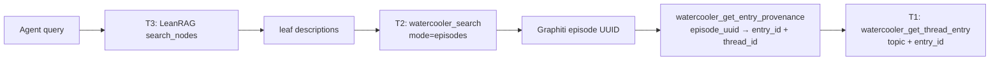

# Semantic Bridge: T3 to T1 Reverse Provenance

The semantic bridge traces high-level T3 (LeanRAG) concepts back to their
source T1 (watercooler) entries through T2 (Graphiti) episodes. This enables
agents to verify and cite original sources when working with clustered
knowledge.

## Prerequisites

Reverse provenance requires:

1. **T2 indexing**: Episodes exist in Graphiti for the target group (via
   `watercooler_bulk_index`)
2. **T3 indexing**: LeanRAG pipeline has run (via `watercooler_leanrag_run_pipeline`)
3. **Entry-episode index**: Populated automatically during `watercooler_bulk_index`
   when Graphiti sync completes

Check readiness with `watercooler_diagnose_memory`.

## Pattern Overview



An agent traces a T3 concept to source entries in four steps:

1. **Query T3** — LeanRAG semantic search returns cluster summaries and leaf
   entity descriptions
2. **Bridge to T2** — Use leaf descriptions as query keys in Graphiti episode
   search to get episode UUIDs
3. **Resolve provenance** — Map episode UUID to entry ID + thread ID via the
   entry-episode index
4. **Read source** — Fetch the original T1 entry with full body text

## Step-by-Step Flow

### 1. Query LeanRAG (T3)

```python
watercooler_search(
    query="authentication architecture",
    mode="entries",
    code_path="/home/user/my-project",
    backend="leanrag"
)
```

The response `context` field and individual `topk` entries contain leaf entity
descriptions that serve as bridge inputs. Extract named entities and specific
phrases from these fields.

> **Preliminary precision estimates** (not yet empirically validated):
> With named entities in leaf descriptions, expect precision 0.65-0.80,
> recall 0.55-0.75. Abstract summaries yield lower precision (0.30-0.50).
> Phase 2 enrichment (Graphiti-seeded descriptions) will improve this.
> These numbers will shift as embedding models and clustering params evolve.

### 2. Bridge to Graphiti Episodes (T2)

```python
watercooler_search(
    query="JWT RS256 authentication middleware",  # From T3 leaf description
    mode="episodes",
    code_path="/home/user/my-project"
)
```

Each result includes an `episode_uuid` field.

### 3. Resolve Entry Provenance

```python
watercooler_get_entry_provenance(
    episode_uuid="ep-uuid-from-step-2"
)
```

Returns:
```json
{
  "provenance_available": true,
  "entry_id": "01AUTH001",
  "thread_id": "auth-feature",
  "episode_uuid": "ep-uuid-from-step-2",
  "indexed_at": "2025-01-15T10:00:00Z"
}
```

For chunked entries (long entries split across multiple episodes):
```json
{
  "provenance_available": true,
  "entry_id": "01LONG001",
  "thread_id": "architecture-review",
  "episodes": [
    {"episode_uuid": "ep-chunk-0", "chunk_index": 0, "total_chunks": 3},
    {"episode_uuid": "ep-chunk-1", "chunk_index": 1, "total_chunks": 3},
    {"episode_uuid": "ep-chunk-2", "chunk_index": 2, "total_chunks": 3}
  ]
}
```

### 4. Read Source Entry (T1)

```python
watercooler_get_thread_entry(
    topic="auth-feature",      # thread_id from provenance
    entry_id="01AUTH001"        # entry_id from provenance
)
```

## Why Semantic Bridging (Not Structural Links)

The bridge uses **semantic similarity** between tiers rather than hard-coded
cross-tier indexes:

- **Self-maintaining**: No separate index to keep in sync across T2 and T3
- **No cross-tier coupling**: T3 clusters can be rebuilt independently of T2
- **Graceful degradation**: If T3 is unavailable, T2 search still works
  directly; if provenance index is empty, agents see the raw entity name
  and cluster summary rather than failing

## When Provenance Is Unavailable

`watercooler_get_entry_provenance` returns `provenance_available: false` when:

- The entry-episode index has no mapping for the given UUID
- The entry was indexed before the index was introduced
- The Graphiti sync for that entry hasn't completed

When this happens, fall back to the raw entity name and cluster summary from
T3. The information is still useful even without a direct citation to T1.

The response includes `action_hints` suggesting remediation:
```json
{
  "provenance_available": false,
  "lookup_key": "ep-unknown-uuid",
  "message": "No mapping found for this episode UUID",
  "action_hints": [
    "Run watercooler_bulk_index to populate the index",
    "Check watercooler_diagnose_memory for backend status"
  ]
}
```

## Limitations

- **Leaf description quality**: Bridge precision depends on how specific the
  LeanRAG leaf descriptions are. Phase 2 will add Graphiti-seeded descriptions
  to improve this.
- **Index coverage**: Only episodes indexed after the entry-episode index was
  introduced will have provenance mappings.
- **Single-group scope**: Provenance lookups are scoped to the configured
  backend group. Cross-group lookups require explicit `code_path` routing.

## Configuration

The entry-episode index path is determined by:

1. `entry_episode_index_path` in Graphiti config (from `config.toml`)
2. Default: `~/.watercooler/graphiti/entry_episode_index.json`

LeanRAG and Graphiti backends are configured via `~/.watercooler/config.toml`.
See `docs/CONFIGURATION.md` for the full schema.
