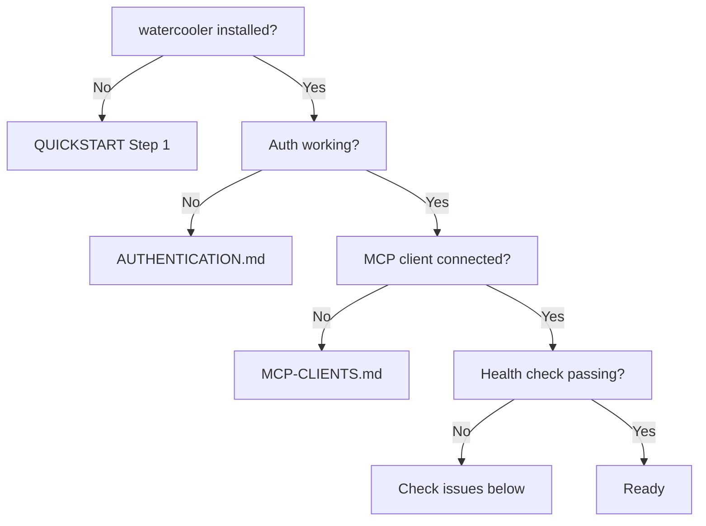

# Troubleshooting

## Setup flowchart

Use this to find where you're stuck before reading the issue list.



Run `watercooler_health` from your MCP client to jump straight to step G.

---

## Top 10 issues

### Server not loading {#server-not-loading}

**Symptom:** Your MCP client can't find `watercooler_health` or any `watercooler_*` tool.

**Cause:** The MCP server process failed to start, or the client config is wrong.

**Fix:**

1. Check that `uvx` is on your PATH:
   ```bash
   which uvx
   ```
   If not found, install `uv`: `curl -LsSf https://astral.sh/uv/install.sh | sh`

2. Verify the server starts manually:
   ```bash
   uvx --from git+https://github.com/mostlyharmless-ai/watercooler@main watercooler-mcp
   ```
   If it errors, the issue is with the `uvx` invocation or network access.

3. Restart your MCP client after fixing the config.

**Logs:**
- Claude Code: `~/.claude/logs/mcp-*.log`
- Cursor: Output panel → MCP dropdown
- Codex: `~/.codex/logs/`

---

### Auth failure {#auth-failure}

**Symptom:** Git push errors, 401 responses, or `authentication required` in logs.

**Cause:** GitHub token missing, expired, or not configured for git.

**Fix:**

```bash
gh auth status          # check current auth state
gh auth login           # re-authenticate if needed
gh auth setup-git       # ensure git is using gh CLI as credential helper
```

Or set a token explicitly:

```bash
export GITHUB_TOKEN=ghp_xxxxxxxxxxxxxxxxxxxx
```

For PAT-based setups, verify `~/.watercooler/credentials.toml` has a valid `[github]`
section. See [AUTHENTICATION.md](./AUTHENTICATION.md).

---

### Thread not found

**Symptom:** `watercooler_read_thread` returns nothing, or a thread you created isn't showing.

**Cause:** Branch scoping. Thread reads are filtered to your current code branch by default.
If you created the thread on `feature/auth` and are now on `main`, the thread appears empty.

**Fix:**

```python
# Read across all branches
watercooler_read_thread(topic="my-topic", code_path=".", code_branch="*")
```

Or switch your code branch to match where the thread was created.

---

### "Ball is not mine" or unexpected ball state

**Symptom:** `watercooler_say` fails with a ball-ownership error, or the ball owner shown
in the thread is not what you expected.

**Cause:** Ball state is metadata, not enforced — any agent can call `say` regardless of
who holds the ball. Common reasons the ball shows an unexpected owner:
- Another agent called `say` or `handoff` after you last read the thread state
- Two agents wrote concurrently and the last write set the ball to an unexpected value
- Client and server are on different versions — upgrade then restart your MCP client

**Fix options:**

1. Use `watercooler_ack` to post an entry without affecting the ball — `ack` does not
   require holding the ball.
2. Ask the current ball holder to hand off to you explicitly:
   ```python
   watercooler_handoff(topic="my-topic", code_path=".", target_agent="your-name", agent_func="Claude Code:sonnet-4:pm")
   ```
   The `target_agent` field names the recipient. Without it, the ball goes to the
   caller's configured counterpart, which may not be you.
3. Override with `set-ball` if the other agent is unavailable:
   ```bash
   watercooler set-ball my-topic codex
   ```
4. Verify both CLI/server are current (`watercooler --version`) and restart the MCP
   client after upgrades.

---

### Git sync conflict

**Symptom:** A write fails with a git error, or an entry appears missing after two agents
wrote to the same thread at the same time.

**Cause:** Thread sync is handled automatically by the orphan branch worktree. On
concurrent writes, the worktree attempts an automatic rebase. If it can't auto-resolve,
the operation fails and the stash is preserved — no data is lost.

**Fix:**

1. The uncommitted entry is preserved in the worktree stash at
   `~/.watercooler/worktrees/<repo>/`. Re-run the write operation and it will retry.

2. For a corrupted graph state, restore from git history:
   ```bash
   git -C ~/.watercooler/worktrees/<repo> checkout <commit> -- graph/
   ```
   Or use the recovery script (requires the watercooler source tree — see
   [Migration note](#migration-from-separate-threads-repository) for how to clone it):
   ```bash
   ./scripts/recover_baseline_graph.py /path/to/threads --mode stale
   ```

3. `watercooler_graph_recover()` from your MCP client returns instructions for the
   recovery script and does not modify data directly.

> **Note:** `watercooler sync` is no longer a functional command. Thread sync is
> automatic via the orphan branch worktree since the async queue was removed.

---

### Memory backend connection failure

**Symptom:** `watercooler_smart_query` returns an error or zero results, or
`watercooler_health` reports a memory tier issue.

**Cause:** `smart_query` runs across three tiers (T1, T2, T3). T1 (baseline graph) is
on by default and requires no extra configuration — it just needs the baseline graph to
have been built. T2 (episodic) and T3 (semantic) are opt-in and only active when
explicitly configured. The error scenarios are:

- **T1 not ready:** The baseline graph (`graph/baseline/nodes.jsonl`) doesn't exist yet.
  Build it first: `watercooler baseline-graph build`
- **T2/T3 endpoint unreachable:** T2 or T3 is configured (enabled via env var) but the
  backing service (FalkorDB, embedding server) isn't running.
- **`watercooler_memory` not installed:** The memory package wasn't included in the
  install. Reinstall with the memory extra.

> **Note:** T2/T3 not being configured is not an error — `smart_query` simply runs on
> T1 only.

**Fix:**

```bash
watercooler config show | grep memory   # check memory config
watercooler baseline-graph build        # (re)build the T1 baseline graph if missing
```

Core thread tools (`say`, `ack`, `list`, etc.) always work regardless of memory tier
status. See [CONFIGURATION.md — memory backend](./CONFIGURATION.md#memory-backend) for
T2/T3 setup.

---

### Config not loading

**Symptom:** `watercooler config show` shows unexpected defaults, or settings you changed
in `config.toml` aren't taking effect.

**Cause:** Config file is in the wrong location, has invalid TOML syntax, or uses
invalid section names.

**Fix:**

```bash
watercooler config show --sources    # see which files were loaded
watercooler config validate          # check for syntax errors
```

Valid top-level section names are: `[common]`, `[mcp]`, `[dashboard]`, `[validation]`,
`[memory]`, and `[federation]`. Any other section name (e.g. `[threads]` or `[agent]`)
will be silently ignored by the Pydantic model.

User config location: `~/.watercooler/config.toml`
Project config location: `<project>/.watercooler/config.toml`

---

### Wrong threads directory

**Symptom:** Threads created in one project appear in another, or `init-thread` creates
the thread in an unexpected location.

**Cause:** `code_path` not set on MCP calls, or `WATERCOOLER_DIR` is pointing to the
wrong place.

**Fix:**

Always pass `code_path` on MCP tool calls:

```python
watercooler_list_threads(code_path="/absolute/path/to/your/repo")
```

For the CLI, run commands from inside your repo directory. The CLI auto-detects the git
root.

To inspect where threads are stored:

```bash
watercooler config show | grep threads
ls ~/.watercooler/worktrees/
```

---

### Stale install after upgrade

**Symptom:** New MCP tools aren't available, or `watercooler --version` shows an old
version after upgrading.

**Cause:** `uv` cached the previous version and didn't re-download.

**Fix:**

```bash
uv cache clean watercooler-cloud
uv tool install --from git+https://github.com/mostlyharmless-ai/watercooler@main watercooler-cloud
```

> **Note:** Use the positional argument form (`uv cache clean watercooler-cloud`
> without `--package`). The `--package` flag syntax differs between subcommands.

Then restart your MCP client completely (not just reload).

---

### Migration from separate threads repository

**Symptom:** You have an old `<repo>-threads` repository from a previous watercooler
setup and threads aren't appearing after upgrading.

**Cause:** The old model used a separate `-threads` repository. The current model uses an
orphan branch (`watercooler/threads`) inside your code repo.

**Fix:**

> **Note:** The migration script is not included in the `uv tool install` package. You
> need the watercooler source tree to run it:
> ```bash
> git clone https://github.com/mostlyharmless-ai/watercooler
> cd watercooler
> ```

1. **Dry run** (default — shows what would be migrated without changing anything):
   ```bash
   python scripts/migrate_to_orphan_branch.py /path/to/code-repo /path/to/threads-repo
   ```

2. **Execute** once the dry-run output looks correct:
   ```bash
   python scripts/migrate_to_orphan_branch.py /path/to/code-repo /path/to/threads-repo --execute
   ```

3. **Verify** the migration:
   ```python
   watercooler_health(code_path=".")
   ```

4. **Clean up config:** Remove any `threads_suffix` or `threads_pattern` settings from
   `config.toml` — these are not needed with the orphan-branch model.

5. **Archive the old repo** once migration is confirmed (the script does not delete it).
