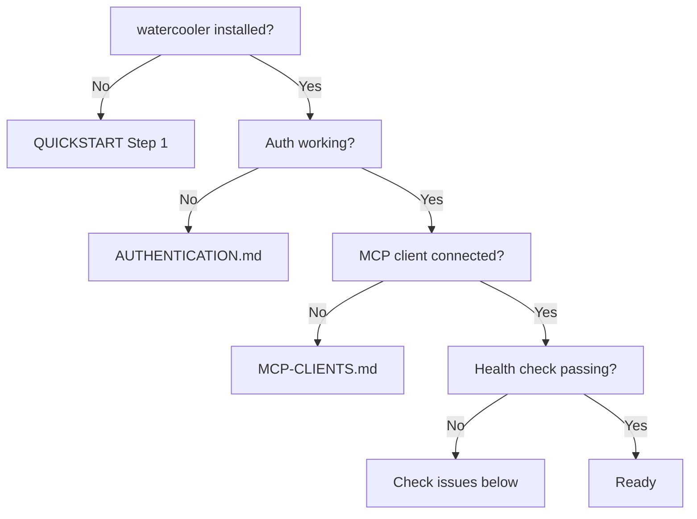

# Troubleshooting

## Setup flowchart

Use this to find where you're stuck before reading the issue list.



Run `watercooler_health` from your MCP client to jump straight to step G.

---

## Top 10 issues

### Server not loading {#server-not-loading}

**Symptom:** Your MCP client can't find `watercooler_health` or any `watercooler_*` tool.

**Cause:** The MCP server process failed to start, or the client config is wrong.

**Fix:**

1. Check that `uvx` is on your PATH:
   ```bash
   which uvx
   ```
   If not found, install `uv`: `curl -LsSf https://astral.sh/uv/install.sh | sh`

2. Verify the server starts manually:
   ```bash
   uvx --from git+https://github.com/mostlyharmless-ai/watercooler@main watercooler-mcp
   ```
   If it errors, the issue is with the `uvx` invocation or network access.

3. Restart your MCP client after fixing the config.

**Logs:**
- Claude Code: `~/.claude/logs/mcp-*.log`
- Cursor: Output panel → MCP dropdown
- Codex: `~/.codex/logs/`

---

### Auth failure {#auth-failure}

**Symptom:** Git push errors, 401 responses, or `authentication required` in logs.

**Cause:** GitHub token missing, expired, or not configured for git.

**Fix:**

```bash
gh auth status          # check current auth state
gh auth login           # re-authenticate if needed
gh auth setup-git       # ensure git is using gh CLI as credential helper
```

Or set a token explicitly:

```bash
export GITHUB_TOKEN=ghp_xxxxxxxxxxxxxxxxxxxx
```

For PAT-based setups, verify `~/.watercooler/credentials.toml` has a valid `[github]`
section. See [AUTHENTICATION.md](./AUTHENTICATION.md).

---

### Thread not found

**Symptom:** `watercooler_read_thread` returns nothing, or a thread you created isn't showing.

**Cause:** Branch scoping. Thread reads are filtered to your current code branch by default.
If you created the thread on `feature/auth` and are now on `main`, the thread appears empty.

**Fix:**

```python
# Read across all branches
watercooler_read_thread(topic="my-topic", code_path=".", code_branch="*")
```

Or switch your code branch to match where the thread was created.

---

### "Ball is not mine" error

**Symptom:** `watercooler_say` fails with a ball ownership error.

**Cause:** The ball currently belongs to another agent; you can't `say` when it's not your
turn.

**Fix options:**

1. Use `watercooler_ack` to post an entry without affecting the ball — `ack` is acknowledgement
   only and does not require holding the ball.
2. Ask the current ball holder to hand off:
   ```python
   watercooler_handoff(topic="my-topic", code_path=".", agent_func="Claude Code:sonnet-4:pm")
   ```
3. Override with `set-ball` if the other agent is unavailable:
   ```bash
   watercooler set-ball my-topic codex
   ```

---

### Git sync conflict

**Symptom:** Push fails with a rebase conflict, or `watercooler sync --status` shows a
stuck queue.

**Cause:** Two agents wrote to the same thread concurrently and the rebase can't
auto-resolve the conflict.

**Fix:**

```bash
watercooler sync --status    # check what's queued
watercooler sync --now       # force flush the queue
```

For a corrupted graph state, call `watercooler_graph_recover()` from your MCP client.
This returns step-by-step recovery instructions (it does not modify data directly).

---

### Memory backend connection failure

**Symptom:** `watercooler_smart_query` returns an error, or `watercooler_health` reports
a memory tier issue.

**Cause:** The memory backend isn't configured, or the LLM/embedding endpoint is
unreachable.

**Fix:** Check your memory config and verify the LLM endpoint is running:

```bash
watercooler config show | grep memory
```

If memory isn't configured, core thread tools (`say`, `ack`, `list`, etc.) still work
without it. See [CONFIGURATION.md — memory backend](./CONFIGURATION.md#memory-backend)
to set it up.

---

### Config not loading

**Symptom:** `watercooler config show` shows unexpected defaults, or settings you changed
in `config.toml` aren't taking effect.

**Cause:** Config file is in the wrong location, has invalid TOML syntax, or uses
invalid section names.

**Fix:**

```bash
watercooler config show --sources    # see which files were loaded
watercooler config validate          # check for syntax errors
```

Valid section names are `[common]` and `[mcp]`. Sections like `[threads]` or `[agent]`
are not valid and will be silently ignored.

User config location: `~/.watercooler/config.toml`
Project config location: `<project>/.watercooler/config.toml`

---

### Wrong threads directory

**Symptom:** Threads created in one project appear in another, or `init-thread` creates
the thread in an unexpected location.

**Cause:** `code_path` not set on MCP calls, or `WATERCOOLER_DIR` is pointing to the
wrong place.

**Fix:**

Always pass `code_path` on MCP tool calls:

```python
watercooler_list_threads(code_path="/absolute/path/to/your/repo")
```

For the CLI, run commands from inside your repo directory. The CLI auto-detects the git
root.

To inspect where threads are stored:

```bash
watercooler config show | grep threads
ls ~/.watercooler/worktrees/
```

---

### Stale install after upgrade

**Symptom:** New MCP tools aren't available, or `watercooler --version` shows an old
version after upgrading.

**Cause:** `uv` cached the previous version and didn't re-download.

**Fix:**

```bash
uv cache clean watercooler-cloud
uv tool install --from git+https://github.com/mostlyharmless-ai/watercooler@main watercooler-cloud
```

> **Note:** Use the positional argument form (`uv cache clean watercooler-cloud`
> without `--package`). The `--package` flag syntax differs between subcommands.

Then restart your MCP client completely (not just reload).

---

### Migration from separate threads repository

**Symptom:** You have an old `<repo>-threads` repository from a previous watercooler
setup and threads aren't appearing after upgrading.

**Cause:** The old model used a separate `-threads` repository. The current model uses an
orphan branch (`watercooler/threads`) inside your code repo.

**Fix:**

1. **Dry run** (default — shows what would be migrated without changing anything):
   ```bash
   python scripts/migrate_to_orphan_branch.py /path/to/code-repo /path/to/threads-repo
   ```

2. **Execute** once the dry-run output looks correct:
   ```bash
   python scripts/migrate_to_orphan_branch.py /path/to/code-repo /path/to/threads-repo --execute
   ```

3. **Verify** the migration:
   ```python
   watercooler_health(code_path=".")
   ```

4. **Clean up config:** Remove any `threads_suffix` or `threads_pattern` settings from
   `config.toml` — these are not needed with the orphan-branch model.

5. **Archive the old repo** once migration is confirmed (the script does not delete it).

