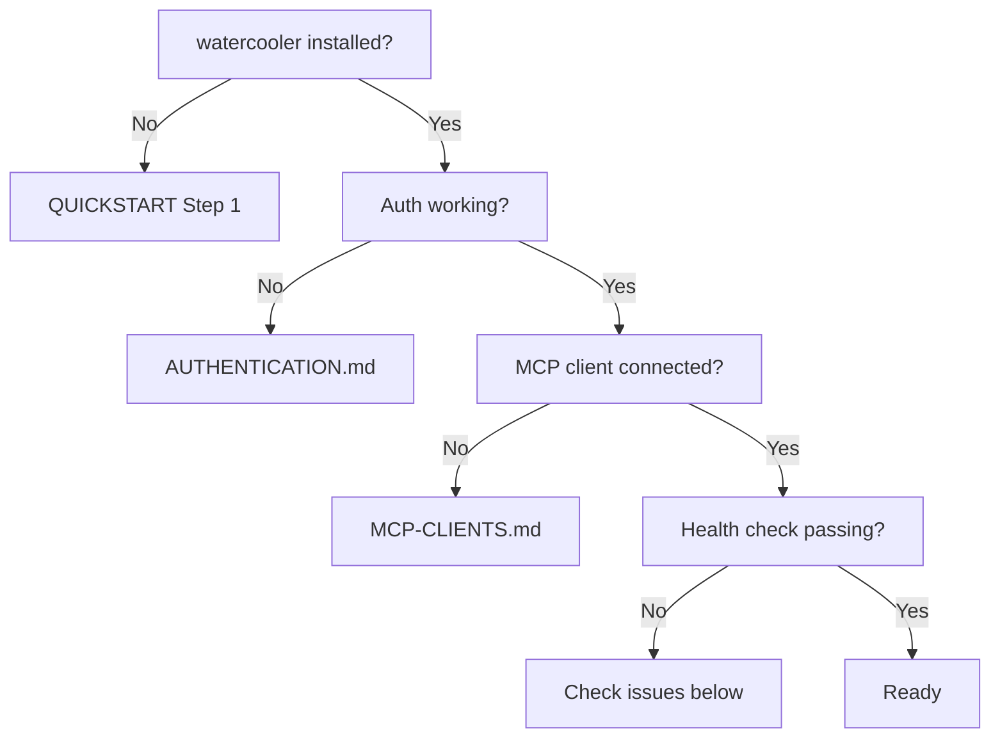

# Troubleshooting

## Setup flowchart

Use this to find where you're stuck before reading the issue list.


```mermaid
flowchart TD
    A[watercooler installed?] -->|No| B[QUICKSTART Step 1]
    A -->|Yes| C[Auth working?]
    C -->|No| D[AUTHENTICATION.md]
    C -->|Yes| E[MCP client connected?]
    E -->|No| F[MCP-CLIENTS.md]
    E -->|Yes| G[Health check passing?]
    G -->|No| H[Check issues below]
    G -->|Yes| I[Ready]
```

Run `watercooler_health` from your MCP client to jump straight to step G.

---

## Top 10 issues

### Server not loading {#server-not-loading}

**Symptom:** Your MCP client can't find `watercooler_health` or any `watercooler_*` tool.

**Cause:** The MCP server process failed to start, or the client config is wrong.

**Fix:**

1. Check that `uvx` is on your PATH:
   ```bash
   which uvx
   ```
   If not found, install `uv`: `curl -LsSf https://astral.sh/uv/install.sh | sh`

2. Verify the server starts manually:
   ```bash
   uvx --from git+https://github.com/mostlyharmless-ai/watercooler@main watercooler-mcp
   ```
   If it errors, the issue is with the `uvx` invocation or network access.

3. Restart your MCP client after fixing the config.

**Logs:**
- Claude Code: `~/.claude/logs/mcp-*.log`
- Cursor: Output panel → MCP dropdown
- Codex: `~/.codex/logs/`

---

### Auth failure {#auth-failure}

**Symptom:** Git push errors, 401 responses, or `authentication required` in logs.

**Cause:** GitHub token missing, expired, or not configured for git.

**Fix:**

```bash
gh auth status          # check current auth state
gh auth login           # re-authenticate if needed
gh auth setup-git       # ensure git is using gh CLI as credential helper
```

Or set a token explicitly:

```bash
export GITHUB_TOKEN=ghp_xxxxxxxxxxxxxxxxxxxx
```

For PAT-based setups, verify `~/.watercooler/credentials.toml` has a valid `[github]`
section. See [AUTHENTICATION.md](./AUTHENTICATION.md).

---

### Thread not found

**Symptom:** `watercooler_read_thread` returns nothing, or a thread you created isn't showing.

**Cause:** Branch scoping. Thread reads are filtered to your current code branch by default.
If you created the thread on `feature/auth` and are now on `main`, the thread appears empty.

**Fix:**

```python
# Read across all branches
watercooler_read_thread(topic="my-topic", code_path=".", code_branch="*")
```

Or switch your code branch to match where the thread was created.

---

### "Ball is not mine" or unexpected ball state

**Symptom:** `watercooler_say` fails with a ball-ownership error, or the ball owner shown
in the thread is not what you expected.

**Cause:** Ball state is metadata, not enforced — any agent can call `say` regardless of
who holds the ball. Common reasons the ball shows an unexpected owner:
- Another agent called `say` or `handoff` after you last read the thread state
- Two agents wrote concurrently and the last write set the ball to an unexpected value
- Client and server are on different versions — upgrade then restart your MCP client

**Fix options:**

1. Use `watercooler_ack` to post an entry without affecting the ball — `ack` does not
   require holding the ball.
2. Ask the current ball holder to hand off to you explicitly:
   ```python
   watercooler_handoff(topic="my-topic", code_path=".", target_agent="your-name", agent_func="Claude Code:sonnet-4:pm")
   ```
   The `target_agent` field names the recipient. Without it, the ball goes to the
   caller's configured counterpart, which may not be you.
3. Override with `set-ball` if the other agent is unavailable:
   ```bash
   watercooler set-ball my-topic codex
   ```
4. Verify both CLI/server are current (`watercooler --version`) and restart the MCP
   client after upgrades.

---

### Git sync conflict

**Symptom:** A write fails with a git error, or an entry appears missing after two agents
wrote to the same thread at the same time.

**Cause:** Thread sync is handled automatically by the orphan branch worktree. On
concurrent writes, the worktree attempts an automatic rebase. If it can't auto-resolve,
the operation fails and the stash is preserved — no data is lost.

**Fix:**

1. The uncommitted entry is preserved in the worktree stash at
   `~/.watercooler/worktrees/<repo>/`. Re-run the write operation and it will retry.

2. For a corrupted graph state, restore from git history:
   ```bash
   git -C ~/.watercooler/worktrees/<repo> checkout <commit> -- graph/
   ```
   Or use the recovery script (requires the watercooler source tree — see
   [Migration note](#migration-from-separate-threads-repository) for how to clone it):
   ```bash
   ./scripts/recover_baseline_graph.py /path/to/threads --mode stale
   ```

3. `watercooler_graph_recover()` from your MCP client returns instructions for the
   recovery script and does not modify data directly.

---

### Memory backend connection failure

**Symptom:** `watercooler_smart_query` returns an error or zero results, or
`watercooler_health` reports a memory tier issue.

**Cause:** `smart_query` runs across three tiers (T1, T2, T3). T1 (baseline graph) is
on by default and requires no extra configuration — it just needs the baseline graph to
have been built. T2 (episodic) and T3 (semantic) are opt-in and only active when
explicitly configured. The error scenarios are:

- **T1 not ready:** The baseline graph (`graph/baseline/nodes.jsonl`) doesn't exist yet.
  Build it first: `watercooler baseline-graph build`
- **T2/T3 endpoint unreachable:** T2 or T3 is configured (enabled via config or env var)
  but the backing service (FalkorDB, embedding server) isn't running.
- **`watercooler_memory` not installed:** The memory package wasn't included in the
  install. Reinstall with the memory extra.

> **Note:** T2/T3 not being configured is not an error — `smart_query` simply runs on
> T1 only.

**Fix:**

```bash
watercooler config show | grep memory   # check memory config
watercooler baseline-graph build        # (re)build the T1 baseline graph if missing
```

Core thread tools (`say`, `ack`, `list`, etc.) always work regardless of memory tier
status. See [CONFIGURATION.md — memory backend](./CONFIGURATION.md#memory-backend) for
T2/T3 setup.

---

### Config not loading

**Symptom:** `watercooler config show` shows unexpected defaults, or settings you changed
in `config.toml` aren't taking effect.

**Cause:** Config file is in the wrong location, has invalid TOML syntax, or uses
invalid section names.

**Fix:**

```bash
watercooler config show --sources    # see which files were loaded
watercooler config validate          # check for syntax errors
```

Valid top-level section names are: `[common]`, `[mcp]`, `[dashboard]`, `[validation]`,
`[memory]`, and `[federation]`. Any other section name (e.g. `[threads]` or `[agent]`)
will be silently ignored by the Pydantic model.

User config location: `~/.watercooler/config.toml`
Project config location: `<project>/.watercooler/config.toml`

---

### Wrong threads directory

**Symptom:** Threads created in one project appear in another, or `init-thread` creates
the thread in an unexpected location.

**Cause:** `code_path` not set on MCP calls, or `WATERCOOLER_DIR` is pointing to the
wrong place.

**Fix:**

Always pass `code_path` on MCP tool calls:

```python
watercooler_list_threads(code_path="/absolute/path/to/your/repo")
```

For the CLI, run commands from inside your repo directory. The CLI auto-detects the git
root.

To inspect where threads are stored:

```bash
watercooler config show | grep threads
ls ~/.watercooler/worktrees/
```

---

### Stale install after upgrade

**Symptom:** New MCP tools aren't available, or `watercooler --version` shows an old
version after upgrading.

**Cause:** `uv` cached the previous version and didn't re-download.

**Fix:**

```bash
uv cache clean watercooler
uv tool install --from git+https://github.com/mostlyharmless-ai/watercooler@main watercooler
```

> **Note:** Use the positional argument form (`uv cache clean watercooler`
> without `--package`). The `--package` flag syntax differs between subcommands.

Then restart your MCP client completely (not just reload).

---

### Migration from separate threads repository

**Symptom:** You have an old `<repo>-threads` repository from a previous watercooler
setup and threads aren't appearing after upgrading.

**Cause:** The old model used a separate `-threads` repository. The current model uses an
orphan branch (`watercooler/threads`) inside your code repo.

**Fix:**

> **Note:** The migration script is not included in the `uv tool install` package. You
> need the watercooler source tree to run it:
> ```bash
> git clone https://github.com/mostlyharmless-ai/watercooler
> cd watercooler
> ```

1. **Dry run** (default — shows what would be migrated without changing anything):
   ```bash
   python scripts/migrate_to_orphan_branch.py /path/to/code-repo /path/to/threads-repo
   ```

2. **Execute** once the dry-run output looks correct:
   ```bash
   python scripts/migrate_to_orphan_branch.py /path/to/code-repo /path/to/threads-repo --execute
   ```

3. **Verify** the migration:
   ```python
   watercooler_health(code_path=".")
   ```

4. **Clean up config:** Remove any `threads_suffix` or `threads_pattern` settings from
   `config.toml` — these are not needed with the orphan-branch model.

5. **Archive the old repo** once migration is confirmed (the script does not delete it).

---

### Sync push failure warning {#sync-push-failure}

**Symptom:** MCP write tools (say, ack, handoff, set_status, annotate) return a response
containing `⚠️ Entry committed locally but push to remote failed`.

**What happened:** The entry was written to your local graph and committed to the orphan
branch, but the git push to the remote failed after retries. The entry exists locally
but is not visible to other team members or the dashboard.

**Cause:** Usually a concurrent write from another machine or agent caused a conflict
that couldn't be resolved by rebase.

**Fix:**

```bash
cd ~/.watercooler/worktrees/<your-repo>
git fetch origin watercooler/threads
git rebase origin/watercooler/threads
git push origin watercooler/threads
```

Or use the MCP repair tool:

```python
watercooler_sync_repair(code_path=".")
```

**Prevention:** This is most common when multiple agents write to the same thread
simultaneously from different machines. The retry logic handles most conflicts
automatically — this warning only appears when retries are exhausted.

---

## PostCompact hook not firing after Python environment recreated

**Symptom:** Session themes stopped appearing in `session-context-*` threads after
running `uv sync` or recreating your virtual environment.

**Cause:** `watercooler setup-pulse-hook` stores the absolute path to the
`watercooler-capture-theme` binary (e.g.
`/home/yourname/.local/bin/watercooler-capture-theme`). If the environment is
recreated, the binary may be installed at a different path, making the stored hook
command stale.

**Fix:**

1. Check what is currently stored in `~/.claude/settings.json` under
   `hooks.PostCompact`.
2. Verify the stored path still exists:
   ```bash
   which watercooler-capture-theme
   ```
3. If the path changed, remove the stale entry from `~/.claude/settings.json`
   manually (or delete the `hooks.PostCompact` array), then re-run:
   ```bash
   watercooler setup-pulse-hook
   ```
4. Restart your Claude Code session.

**Prevention:** After any `pip install`, `uv sync`, or environment reinstall, rerun
`watercooler setup-pulse-hook` to refresh the stored path.

---

### FalkorDB graph name mismatch {#falkordb-graph-name}

**Symptom:** `watercooler_smart_query` or `watercooler_search(semantic=true)` returns
zero results on Railway, even though entries have been indexed.

**Cause:** The graph database name used during indexing differs from the one used during
search. FalkorDB vector indices are scoped to the graph name. If
`WATERCOOLER_GRAPHITI_DATABASE` is set during indexing but absent during search (or
vice versa), the index names won't match.

**Fix:**

1. Check the current graph name:
   ```python
   watercooler_health(code_path=".")
   # Look for "graphiti_database" in the output
   ```

2. Ensure `WATERCOOLER_GRAPHITI_DATABASE` is set consistently across all environments
   that share a FalkorDB instance. The recommended value is `watercooler_cloud`.

3. If the graph name changed, rebuild the graph:
   ```python
   watercooler_bulk_index(code_path=".", force=True)
   ```

---

### OpenRouter embedding setup on Railway {#openrouter-embedding}

**Symptom:** Embedding operations fail on Railway with connection errors or model-not-found
errors.

**Cause:** Railway can't run local llama-server. Embeddings must use an external API.

**Fix:**

Set all four embedding variables on Railway:

```
EMBEDDING_API_BASE=https://openrouter.ai/api/v1
EMBEDDING_MODEL=baai/bge-m3
EMBEDDING_DIM=1024
EMBEDDING_API_KEY=sk-or-v1-...
```

`EMBEDDING_DIM` must match the model's actual output dimension (1024 for bge-m3).
A dimension mismatch causes silent vector index failures.

---

## Hosted deployment diagnostics

### Request traces in stderr

In hosted mode (Railway, Docker, etc.), the MCP server emits structured
request-trace logs to stderr. Each trace records the pipeline stages a request
passed through: `auth.resolve`, `rpc.parse`, `rpc.session.lookup`, `rpc.route`,
`rpc.serialize`, along with per-stage durations and outcomes.

Railway labels all stderr output as "error" level in its log viewer — this is a
Railway UI convention, not an actual error. Filter by `request_id` to follow a
single request through the pipeline.

**Viewing traces locally:**

When running the hosted server locally for testing:

```bash
# stderr goes to the terminal by default
python -m uvicorn watercooler_mcp.server_http:app --host 127.0.0.1 --port 8080

# Or capture to a file
python -m uvicorn watercooler_mcp.server_http:app 2> /tmp/mcp-traces.log
```

**Smoke test diagnostics:**

The smoke test suite (`tests/integration/test_railway_smoke.py`) captures the
server subprocess stderr. On test failure, recent stderr output is printed
alongside the failure for quick diagnosis.

---

### Parity warning banner in tool responses {#parity-warning}

**Symptom:** Read tools (`list_threads`, `read_thread`, `search`, etc.) return a
response starting with `⚠ Sync: Threads worktree diverged from origin — data may be
stale.` (or similar).

**Cause:** The threads worktree is in a non-clean parity state. The data returned is
from the local worktree, which may not match the remote.

**Parity states that trigger warnings:**

| State | Meaning | Action |
|-------|---------|--------|
| `diverged` | Local has commits not on remote AND remote has commits not local | `watercooler_sync_repair(code_path=".")` |
| `dirty_mixed` | Uncommitted changes to non-derived files | Inspect and commit or discard |
| `stuck_rebase_or_merge` | Interrupted rebase/merge | `watercooler_sync_repair(code_path=".")` |
| `auth_or_network_error` | Cannot reach remote | Check network/credentials |

**Fix:** Run `watercooler_sync_repair(code_path=".")` or use the CLI:

```bash
watercooler sync-repair --diagnose   # see what's wrong
watercooler sync-repair              # auto-fix safe cases
```

The `sync_guard` daemon auto-heals `behind_only` and `dirty_derived_only` states every
3 minutes. The warning states above require manual intervention.

---

### Premium daemons running locally {#premium-daemons-local}

**Symptom:** `watercooler_health` shows premium daemons (decision_detector,
pulse_snapshot, etc.) running locally with `[local]` label, consuming resources.

**Cause:** `~/.watercooler/config.toml` has `enabled = true` on premium daemon sections.
Premium daemons are meant to run on Railway only.

**Fix:**

Remove `enabled = true` from premium daemon sections in `~/.watercooler/config.toml`.
Keep any config overrides (interval, LLM settings) — these are sent to Railway via
header without triggering local registration.

```toml
# Correct — config overrides only, no enabled = true
[mcp.daemons.decision_detector]

[mcp.daemons.decision_extractor]
interval = 1800.0
```

**Dev override:** To intentionally run premium daemons locally (e.g., for testing):

```bash
WATERCOOLER_DEV_LOCAL_DAEMONS=1 watercooler-mcp
```

Local-only daemons (always safe to enable): `thread_auditor`, `content_scout`,
`content_refiner`, `sync_guard`.
