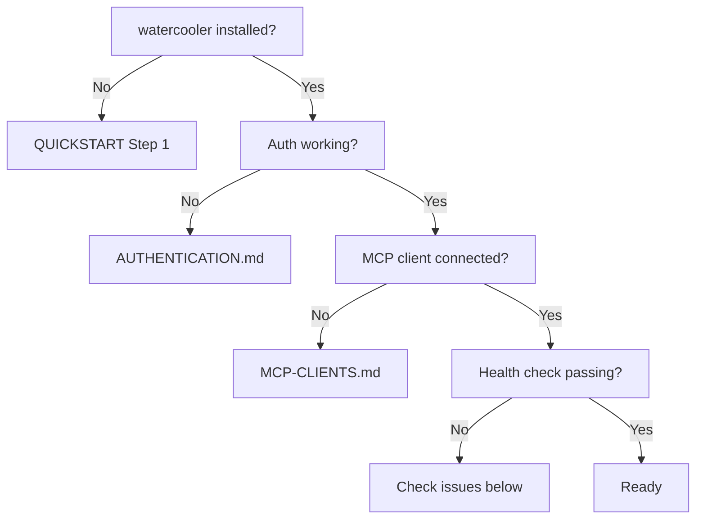

# Troubleshooting

## Setup flowchart

Use this to find where you're stuck before reading the issue list.


```mermaid
flowchart TD
    A[watercooler installed?] -->|No| B[QUICKSTART Step 1]
    A -->|Yes| C[Auth working?]
    C -->|No| D[AUTHENTICATION.md]
    C -->|Yes| E[MCP client connected?]
    E -->|No| F[MCP-CLIENTS.md]
    E -->|Yes| G[Health check passing?]
    G -->|No| H[Check issues below]
    G -->|Yes| I[Ready]
```

Run `watercooler_health` from your MCP client to jump straight to step G.

---

## Top issues

### Server not loading {#server-not-loading}

**Symptom:** Your MCP client can't find `watercooler_health` or any `watercooler_*` tool.

**Cause:** The MCP server process failed to start, or the client config is wrong.

**Fix:**

1. Check that `uvx` is on your PATH:
   ```bash
   which uvx
   ```
   If not found, install `uv`: `curl -LsSf https://astral.sh/uv/install.sh | sh`

2. Verify the server starts manually:
   ```bash
   uvx --from git+https://github.com/mostlyharmless-ai/watercooler@main watercooler-mcp
   ```
   If it errors, the issue is with the `uvx` invocation or network access.

3. Restart your MCP client after fixing the config.

**Logs:**
- Claude Code: `~/.claude/logs/mcp-*.log`
- Cursor: Output panel → MCP dropdown
- Codex: `~/.codex/logs/`

---

### Auth failure {#auth-failure}

**Symptom:** Git push errors, 401 responses, or `authentication required` in logs.

**Cause:** GitHub token missing, expired, or not configured for git.

**Fix:**

```bash
gh auth status          # check current auth state
gh auth login           # re-authenticate if needed
gh auth setup-git       # ensure git is using gh CLI as credential helper
```

Or set a token explicitly:

```bash
export GITHUB_TOKEN=ghp_xxxxxxxxxxxxxxxxxxxx
```

For PAT-based setups, verify `~/.watercooler/credentials.toml` has a valid `[github]`
section. See [AUTHENTICATION.md](./AUTHENTICATION.md).

---

### Thread not found

**Symptom:** `watercooler_read_thread` returns nothing, or a thread you created isn't showing.

**Common causes:**

- wrong `topic` slug
- wrong repository or missing `code_path`
- branch filter hiding the thread

**Fix:**

1. Confirm you are using the exact thread `topic`.
2. Confirm the call is pointed at the correct repo:

```python
watercooler_list_threads(code_path="/absolute/path/to/your/repo")
```

3. If the thread exists but still does not appear, try reading across all branches:

```python
# Read across all branches
watercooler_read_thread(topic="my-topic", code_path=".", code_branch="*")
```

4. If that works, switch back to the branch where the thread was created or keep
   using the explicit `code_branch` filter.

---

### Git sync conflict

**Symptom:** A write fails with a git error, or an entry appears missing after two agents
wrote to the same thread at the same time.

**Cause:** Thread sync is handled automatically by the orphan branch worktree. On
concurrent writes, the worktree attempts an automatic rebase. If it can't auto-resolve,
the operation fails and the stash is preserved — no data is lost.

**Fix:**

1. The uncommitted entry is preserved in the worktree stash at
   `~/.watercooler/worktrees/<repo>/`. Re-run the write operation and it will retry.

2. If the issue persists, inspect the threads worktree:
   ```bash
   git -C ~/.watercooler/worktrees/<repo> status
   ```

3. For a safe first pass, diagnose sync state before making manual changes:
   ```python
   watercooler_sync_repair(code_path=".", diagnose_only=True)
   ```

---

### Config not loading

**Symptom:** `watercooler config show` shows unexpected defaults, or settings you changed
in `config.toml` aren't taking effect.

**Cause:** Config file is in the wrong location, has invalid TOML syntax, or uses
invalid section names.

**Fix:**

```bash
watercooler config show --sources    # see which files were loaded
watercooler config validate          # check for syntax errors
```

Common public sections include: `[common]`, `[mcp]`, `[dashboard]`,
`[validation]`, and `[federation]`. Unknown section names (for example
`[threads]` or `[agent]`) will be silently ignored by the Pydantic model.

User config location: `~/.watercooler/config.toml`
Project config location: `<project>/.watercooler/config.toml`

---

### Wrong threads directory

**Symptom:** Threads created in one project appear in another, or `init-thread` creates
the thread in an unexpected location.

**Cause:** `code_path` not set on MCP calls, or `WATERCOOLER_DIR` is pointing to the
wrong place.

**Fix:**

Always pass `code_path` on MCP tool calls:

```python
watercooler_list_threads(code_path="/absolute/path/to/your/repo")
```

For the CLI, run commands from inside your repo directory. The CLI auto-detects the git
root.

To inspect where threads are stored:

```bash
watercooler config show | grep threads
ls ~/.watercooler/worktrees/
```

---

### Stale install after upgrade

**Symptom:** New MCP tools aren't available, or `watercooler --version` shows an old
version after upgrading.

**Cause:** `uv` cached the previous version and didn't re-download.

**Fix:**

```bash
uv cache clean watercooler
uv tool install --from 'git+https://github.com/mostlyharmless-ai/watercooler@main[local]' watercooler
```

> **Note:** Use the positional argument form (`uv cache clean watercooler`
> without `--package`). The `--package` flag syntax differs between subcommands.

Then restart your MCP client completely (not just reload).

---

### Sync push failure warning {#sync-push-failure}

**Symptom:** MCP write tools (say, ack, handoff, set_status, annotate) return a response
containing `⚠️ Entry committed locally but push to remote failed`.

**What happened:** The entry was written to your local graph and committed to the orphan
branch, but the git push to the remote failed after retries. The entry exists locally
but is not visible to other team members or the dashboard.

**Cause:** Usually a concurrent write from another machine or agent caused a conflict
that couldn't be resolved by rebase.

**Fix:**

```bash
cd ~/.watercooler/worktrees/<your-repo>
git fetch origin watercooler/threads
git rebase origin/watercooler/threads
git push origin watercooler/threads
```

Or use the MCP repair tool:

```python
watercooler_sync_repair(code_path=".")
```

**Prevention:** This is most common when multiple agents write to the same thread
simultaneously from different machines. The retry logic handles most conflicts
automatically — this warning only appears when retries are exhausted.

---
