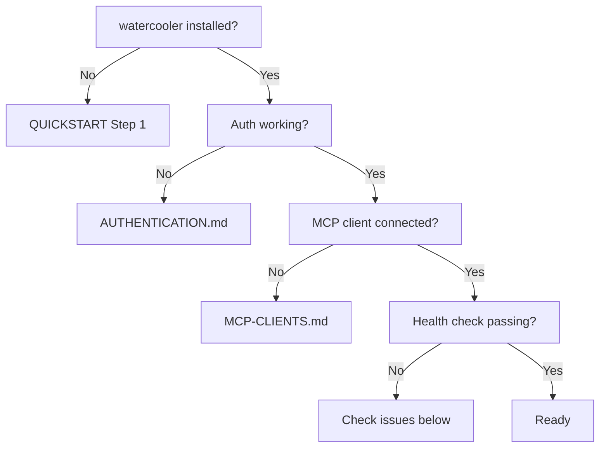

# Troubleshooting

## Setup flowchart

Use this to find where you're stuck before reading the issue list.


```mermaid
flowchart TD
    A[watercooler installed?] -->|No| B[QUICKSTART Step 1]
    A -->|Yes| C[Auth working?]
    C -->|No| D[AUTHENTICATION.md]
    C -->|Yes| E[MCP client connected?]
    E -->|No| F[MCP-CLIENTS.md]
    E -->|Yes| G[Health check passing?]
    G -->|No| H[Check issues below]
    G -->|Yes| I[Ready]
```

Run `watercooler_health` from your MCP client to jump straight to step G.

---

## Top issues

### Server not loading {#server-not-loading}

**Symptom:** Your MCP client can't find `watercooler_health` or any `watercooler_*` tool.

**Cause:** The MCP server process failed to start, or the client config is wrong.

**Fix:**

1. Check that `uvx` is on your PATH:
   ```bash
   which uvx
   ```
   If not found, install `uv`: `curl -LsSf https://astral.sh/uv/install.sh | sh`

2. Verify the server starts manually (use the same `[local]` extra your
   MCP client is configured with, so you're testing the exact install
   path that's failing):

   ```bash
   uvx --from 'git+https://github.com/mostlyharmless-ai/watercooler@main[local]' watercooler-mcp
   ```

   If it errors, the issue is with the `uvx` invocation, the package
   install, or network access.

3. Restart your MCP client after fixing the config.

**Logs:**
- Claude Code: `~/.claude/logs/mcp-*.log`
- Cursor: Output panel → MCP dropdown
- Codex: `~/.codex/logs/`

---

### First-run model download stalled {#first-run-download-stalled}

**Symptom:** `watercooler_health` hangs for a long time on first launch,
or returns an error like `download failed` / `timed out fetching model`
before the LLM or embedding service ever reaches `running`.

**Cause:** On first run Watercooler fetches the `llama-server` binary
(~50 MB) plus two GGUF models (~2.5 GB total). A flaky connection,
corporate proxy, or low disk space can leave the download stalled or
partially written.

**Fix:**

1. Confirm disk space (need ~3 GB free under `~/.watercooler/` and
   `~/.cache/`):

   ```bash
   df -h ~/.watercooler ~/.cache
   ```

2. Clean any partial downloads and retry:

   ```bash
   rm -rf ~/.watercooler/models/*.part
   ```

3. If you're behind a proxy, set `HTTP_PROXY` / `HTTPS_PROXY` before
   relaunching your MCP client so `curl` / `urllib` picks it up.

4. If the download is genuinely unreliable, skip local models entirely
   and point Watercooler at an externally-managed OpenAI-compatible
   endpoint:

   ```toml
   # ~/.watercooler/config.toml
   [mcp.graph]
   auto_start_services = false
   summarizer_api_base = "https://api.example.com/v1"
   summarizer_model = "gpt-4o-mini"
   embedding_api_base = "https://api.example.com/v1"
   embedding_model = "text-embedding-3-small"
   ```

   See
   [CONFIGURATION — `[mcp.graph]`](./CONFIGURATION.md#mcpgraph--baseline-graph-enrichment)
   for the full option list.

5. To run threads without summaries or semantic search at all:

   ```toml
   [mcp.graph]
   generate_summaries = false
   generate_embeddings = false
   auto_start_services = false
   ```

   Threads still work; only the enrichment features are disabled.

---

### Port in use by orphan llama-server {#port-in-use-by-orphan-llama-server}

**Symptom:** `watercooler_health` reports the LLM or embedding service as `failed`
with a message like `LLM port 8000 is already in use by PID 12345` or
`Embedding port 8080 is already in use`.

**Cause:** A previous Watercooler session spawned a `llama-server` process that
did not shut down cleanly — typically because the MCP client (Claude Code,
Cursor, or Codex) crashed or was force-quit rather than exited normally. The
old server still holds the port, so the new session cannot bind. Watercooler
refuses to start a second `llama-server` on an occupied port because doing so
silently would make your agent issue embedding/LLM calls against the *old*
server, masking real bugs in the current session's model or config.

**Fix — identify and kill the orphan process:**

Windows (PowerShell):

```powershell
# Find who owns the port (example: 8080 for embedding, 8000 for LLM)
Get-NetTCPConnection -LocalPort 8080 -State Listen |
  Select-Object LocalAddress, LocalPort, OwningProcess

# Kill it (substitute the OwningProcess from above)
Stop-Process -Id <PID> -Force

# Confirm the port is free
Get-NetTCPConnection -LocalPort 8080 -State Listen -ErrorAction SilentlyContinue
# (should print nothing)
```

macOS / Linux:

```bash
# Find who owns the port
lsof -nP -iTCP:8080 -sTCP:LISTEN

# Kill it
kill <PID>   # add -9 only if it doesn't exit after a few seconds

# Confirm the port is free
lsof -nP -iTCP:8080 -sTCP:LISTEN
# (should print nothing)
```

Then restart your MCP client. The next `watercooler_health` call should show
both services as `running` and spawn fresh `llama-server` processes owned by
the current session.

**Why Watercooler refuses to kill the orphan for you:** early versions masked
this failure mode by reusing whatever was listening on the port, which caused
"clean install" tests to appear green when they weren't (see
`windows-release-hardening` thread). If Watercooler auto-killed processes it
didn't spawn, a user running other unrelated local tools on 8000 or 8080
would see them die unexpectedly. Explicit refusal + remediation is the trade
we picked.

**If the PID keeps re-appearing:** an MCP client may be auto-restarting and
re-spawning the orphan on each launch. Fully quit the client, kill the PID,
then relaunch. If you're on Windows, check for multiple `llama-server.exe`
entries in Task Manager and end them all before relaunching.

---

### Local-only mode {#local-only-mode}

**Symptom:** A watercooler write (`watercooler_say`, `watercooler_ack`,
`watercooler init-thread`, etc.) exits with:

```
Cannot write threads — target is not a GitHub-backed git repository.
  Resolved threads dir: <path>
  Reason: <specific check that failed>

To proceed:
  - cd into a git repository with a GitHub 'origin' remote, OR
  - set WATERCOOLER_DIR=<path> to point at an existing GitHub-backed
    threads directory, OR
  - set WATERCOOLER_ALLOW_LOCAL_ONLY=1 to explicitly enable local-only
    mode (threads will NOT be pushed to any remote).
```

**Cause:** Watercooler threads are designed to be backed by a GitHub-hosted
git repository (the orphan `watercooler/threads` branch on the code repo's
origin). The write guard refuses to silently fall back to a local directory
that never pushes anywhere, because that contradicts the "threads are
GitHub-backed" product contract.

You'll hit this when:

- You ran the command from outside any git repository (e.g., from the
  parent of a repo directory, or from a scratch folder).
- Your code repo has no `origin` remote configured, or the `origin` URL
  doesn't point at a GitHub-family host (github.com, GitHub Enterprise
  subdomains, or `github.*` tenants).
- The resolved threads directory's gitdir pointer is broken.

**Fix (99% of the time):** `cd` into a git repository with a GitHub `origin`
remote before running the command. All subsequent watercooler writes will
push to `watercooler/threads` on that origin.

**Fix (existing threads elsewhere):** point `WATERCOOLER_DIR` at the
threads directory you want to use:

```bash
export WATERCOOLER_DIR=/path/to/existing/threads-dir
```

**Fix (intentional local-only, e.g., offline work or non-code use):**

```bash
export WATERCOOLER_ALLOW_LOCAL_ONLY=1
```

Threads written in this mode are **not pushed to any remote**. They live
only on your local filesystem and will not sync to teammates or across
machines. The `watercooler_health` output labels this mode explicitly as
`Mode: local-only (no GitHub backing) (WATERCOOLER_ALLOW_LOCAL_ONLY)` so
you can see at a glance that you're in the opt-in configuration.

---

### Stale-read sync warnings

**Symptom:** A thread read returns with a banner like:

```
⚠ Sync: Threads worktree is behind origin and auto-heal could not
fast-forward — data may be stale. Run watercooler_sync_repair.
```

…or `watercooler_health` reports `Safe for Reads: False` with a
`⚠️ STALE DATA (parity=behind_only)` line.

**Cause:** Your local thread worktree is behind its origin, and the
fast-forward pull attempt failed. This usually means the worktree has
local divergence or uncommitted non-derived changes blocking the ff.
Reads continue to return local data but may miss recent entries
pushed by teammates or other agent sessions.

**Fix:** `watercooler sync-repair` reconciles the state (rebases your
local commits onto origin, restores stashed changes). For a stubborn
case, run `watercooler sync-repair --diagnose` first to see what's
blocking the auto-heal before committing to the recovery.

---

### Auth failure {#auth-failure}

**Symptom:** Git push errors, 401 responses, or `authentication required` in logs.

**Cause:** GitHub token missing, expired, or not configured for git.

**Fix:**

```bash
gh auth status          # check current auth state
gh auth login           # re-authenticate if needed
gh auth setup-git       # ensure git is using gh CLI as credential helper
```

Or set a token explicitly:

```bash
export GITHUB_TOKEN=ghp_xxxxxxxxxxxxxxxxxxxx
```

For PAT-based setups, verify `~/.watercooler/credentials.toml` has a valid `[github]`
section. See [AUTHENTICATION.md](./AUTHENTICATION.md).

---

### Thread not found

**Symptom:** `watercooler_read_thread` returns nothing, or a thread you created isn't showing.

**Common causes:**

- wrong `topic` slug
- wrong repository or missing `code_path`
- branch filter hiding the thread

**Fix:**

1. Confirm you are using the exact thread `topic`.
2. Confirm the call is pointed at the correct repo:

```python
watercooler_list_threads(code_path="/absolute/path/to/your/repo")
```

3. If the thread exists but still does not appear, try reading across all branches:

```python
# Read across all branches
watercooler_read_thread(topic="my-topic", code_path=".", code_branch="*")
```

4. If that works, switch back to the branch where the thread was created or keep
   using the explicit `code_branch` filter.

---

### Git sync conflict

**Symptom:** A write fails with a git error, or an entry appears missing after two agents
wrote to the same thread at the same time.

**Cause:** Thread sync is handled automatically by the orphan branch worktree. On
concurrent writes, the worktree attempts an automatic rebase. If it can't auto-resolve,
the operation fails and the stash is preserved — no data is lost.

**Fix:**

1. The uncommitted entry is preserved in the worktree stash at
   `~/.watercooler/worktrees/<repo>/`. Re-run the write operation and it will retry.

2. If the issue persists, inspect the threads worktree:
   ```bash
   git -C ~/.watercooler/worktrees/<repo> status
   ```

3. For a safe first pass, diagnose sync state before making manual changes:
   ```python
   watercooler_sync_repair(code_path=".", diagnose_only=True)
   ```

---

### Config not loading

**Symptom:** `watercooler config show` shows unexpected defaults, or settings you changed
in `config.toml` aren't taking effect.

**Cause:** Config file is in the wrong location, has invalid TOML syntax, or uses
invalid section names.

**Fix:**

```bash
watercooler config show --sources    # see which files were loaded
watercooler config validate          # check for syntax errors
```

Common valid top-level sections: `[common]`, `[mcp]`, `[dashboard]`,
`[validation]`, `[memory]`, and `[federation]`. Unknown section names
(for example `[threads]` or `[agent]`) are silently ignored — Pydantic
models default to `extra="ignore"`, so a typo like `[threeads]` will
not fail validation but also won't take effect. `watercooler config
show --sources` will list exactly which files were read; anything you
expected to appear that doesn't is a typo or a misplaced section.

User config location: `~/.watercooler/config.toml`
Project config location: `<project>/.watercooler/config.toml`

---

### Wrong threads directory

**Symptom:** Threads created in one project appear in another, or `init-thread` creates
the thread in an unexpected location.

**Cause:** `code_path` not set on MCP calls, or `WATERCOOLER_DIR` is pointing to the
wrong place.

**Fix:**

Always pass `code_path` on MCP tool calls:

```python
watercooler_list_threads(code_path="/absolute/path/to/your/repo")
```

For the CLI, run commands from inside your repo directory. The CLI auto-detects the git
root.

To inspect where threads are stored:

```bash
watercooler config show | grep threads
ls ~/.watercooler/worktrees/
```

---

### Stale install after upgrade {#stale-install-after-upgrade}

**Symptom:** New MCP tools aren't available, or `watercooler --version` shows an old
version after upgrading.

**Cause:** `uv` cached the previous version. There are two independent artifacts
that may need to be refreshed — the `uvx`-run MCP server and the installed
`watercooler` CLI — and they are updated with different commands.

**Fix — MCP server (served by `uvx`):**

```bash
uv cache clean watercooler
```

This clears the `uvx` archive cache. The next time your MCP client launches the
server, `uvx` will re-resolve from git and pull the latest `@main`.

**Fix — `watercooler` CLI (installed as a uv tool):**

```bash
uv tool install --from 'git+https://github.com/mostlyharmless-ai/watercooler@main[local]' watercooler
```

This reinstalls the CLI tool itself. Running only `uv cache clean` does not
update an already-installed tool binary.

> **Note:** Use the positional argument form (`uv cache clean watercooler`
> without `--package`). The `--package` flag syntax differs between subcommands.

Then restart your MCP client completely (not just reload).

---

### Sync push failure warning {#sync-push-failure}

**Symptom:** MCP write tools (say, ack, handoff, set_status, annotate) return a response
containing `⚠️ Entry committed locally but push to remote failed`.

**What happened:** The entry was written to your local graph and committed to the orphan
branch, but the git push to the remote failed after retries. The entry exists locally
but is not visible to other team members or the dashboard.

**Cause:** Usually a concurrent write from another machine or agent caused a conflict
that couldn't be resolved by rebase.

**Fix:**

```bash
cd ~/.watercooler/worktrees/<your-repo>
git fetch origin watercooler/threads
git rebase origin/watercooler/threads
git push origin watercooler/threads
```

Or use the MCP repair tool:

```python
watercooler_sync_repair(code_path=".")
```

**Prevention:** This is most common when multiple agents write to the same thread
simultaneously from different machines. The retry logic handles most conflicts
automatically — this warning only appears when retries are exhausted.

---

### CLAUDE.md or AGENTS.md was rewritten and I want to undo it {#undo-agent-context-rewrite}

**Symptom:** You ran `/watercooler-onboarding --update-agent-context` (or
`/update-agent-context --phase1` directly) and the resulting `CLAUDE.md` or
`AGENTS.md` isn't what you wanted.

**Cause:** Phase 1 of `/update-agent-context` is a full structural rewrite. It
intentionally replaces the file rather than patching individual sections.

**Fix:** When invoked through `/watercooler-onboarding --update-agent-context`,
the chain takes timestamped backups before any rewrite. The backups land
**alongside** `CLAUDE.md` / `AGENTS.md` in the repo root (not under
`~/.watercooler/`). List them with:

```bash
ls CLAUDE.md.pre-onboarding.*.bak AGENTS.md.pre-onboarding.*.bak
```

Each filename matches the pattern `<file>.pre-onboarding.<UTC-timestamp>.bak`.
Restore with:

```bash
mv CLAUDE.md.pre-onboarding.<TS>.bak CLAUDE.md
mv AGENTS.md.pre-onboarding.<TS>.bak AGENTS.md
```

(Replace `<TS>` with the timestamp on the actual backup file.) The backup
files are untracked, so you can either keep them as a safety net or delete
them once the rewrite is accepted.

If you ran `/update-agent-context --phase1` directly (not through the chain),
no automatic backup is taken. Recover from `git`:

```bash
git diff CLAUDE.md AGENTS.md      # see what changed
git checkout CLAUDE.md AGENTS.md  # discard the rewrite
```

That assumes the previous version was committed. If `CLAUDE.md` was
uncommitted local work, the rewrite is unrecoverable from git — which is
exactly why the `/watercooler-onboarding` chain wraps the call with backups.

---

### `/update-agent-context --phase2` reports no candidates {#agent-context-phase2-no-candidates}

**Symptom:** You ran `/update-agent-context --phase2` and the candidate list
is empty (or nearly so).

**Cause:** Phase 2 patches the `## Project Conventions` block from `Decision`
entries written since the last update. On a young repo, or one that has not
yet captured durable conventions as `Decision`-typed entries, there is
nothing to extract.

**Fix:**

1. Run `/watercooler-onboarding` first if you haven't. Phase 2 also reads the
   `onboarding-*` seed threads (architecture, risk register, docs/contracts,
   team map, entry path) for rule-shaped content, which gives Phase 2 a
   second evidence source to work from.

2. If Watercooler has been in use for a while but Phase 2 still finds
   nothing, agents may have been writing observations as `Note` rather than
   `Decision` entries. Decisions are the higher-trust source for durable
   conventions; ask agents to use `entry_type="Decision"` when they record
   binding choices, and re-run Phase 2 after a batch lands.

3. As a one-time setup, run `/update-agent-context --phase1` to establish the
   `## Project Conventions` block structure. Phase 2 patches that block; if
   it doesn't exist yet, Phase 1 creates the scaffold.

---
